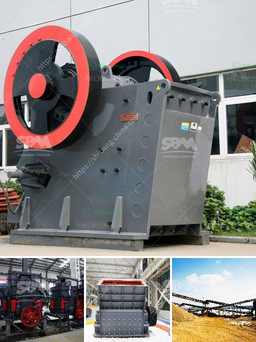

<h3>multi hammer crusher</h3>
Multi-hammer crusher, also known as hammer mill, is designed to grind various types of materials into fine particles. It enables you to control the size of the final product and even influence the texture of the material. It is primarily used in industries such as mining, cement, building materials, and chemical engineering.

The multi-hammer crusher has multiple rotors in various configurations which rotate at high speed, simultaneously impacting the material. This improves the efficiency and capacity of the machine, making it a popular choice for crushing hard materials.

One of the key advantages of the multi-hammer crusher is its ability to produce a wide range of particle sizes. By adjusting the gap between the rotors, you can control the size of the final product. This versatility makes it suitable for various applications, such as producing fine aggregates for construction or grinding minerals for extraction processes.

The multi-hammer crusher is also known for its ability to finely grind materials. The high-speed rotation of the rotors generates a strong impact force, causing the materials to break and grind against each other. This ensures a finer and more uniform grind, resulting in improved product quality.

Furthermore, the multi-hammer crusher has a compact design and occupies less space compared to other crushing equipment. This makes it a preferred choice for plants with limited space. Despite its compact size, it offers high production rates and can handle large volumes of materials.

In addition to its size and efficiency, the multi-hammer crusher is also known for its durability and low maintenance requirements. Its robust construction and high-quality components make it capable of withstanding harsh operating conditions. This reduces the need for frequent repairs or replacements, resulting in lower maintenance costs.

Another notable feature of the multi-hammer crusher is its energy efficiency. The high-speed rotation of the rotors combined with its impact crushing principle reduces the consumption of energy per unit of material processed. This not only helps to reduce energy costs but also contributes to a more sustainable and environmentally friendly operation.

To summarize, the multi-hammer crusher is a versatile and efficient crushing machine that offers a wide range of benefits. Its ability to control the particle size and texture of the final product, along with its compact size, durability, and low maintenance requirements, make it a valuable tool for various industries. Its energy efficiency and environmental friendliness further enhance its appeal. Whether it is used for crushing rocks, minerals, or construction materials, the multi-hammer crusher is a reliable and cost-effective solution.
<h3>Contact us</h3><ul><li><strong>Whatsapp:&nbsp;<a href="https://wa.me/8613661969651">+8613661969651</a></strong></li><li><a href="https://swt.shibang-china.com/?git&amp;zhl&amp;multi hammer crusher"><strong>Online Service(chat now)</strong></a></li></ul><h3>Related</h3><ul><li><a href='process flow gold copper mining.md'>process flow gold copper mining</a></li><li><a href='price for sand machine.md'>price for sand machine</a></li><li><a href='what is the meaning of 100tph in crusher crusher.md'>what is the meaning of 100tph in crusher crusher</a></li><li><a href='how to make ball mill pdf.md'>how to make ball mill pdf</a></li><li><a href='grinding mill barite.md'>grinding mill barite</a></li></ul>