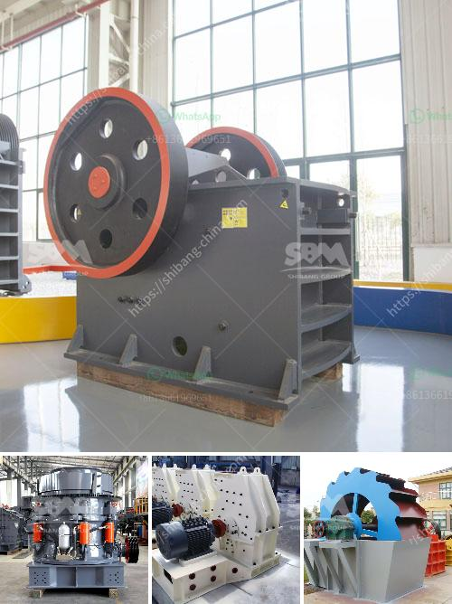

<h3>one ton per hour crushing mill</h3>
In industries that require materials to be crushed in a specific size, a crushing mill with a capacity of one ton per hour is an ideal choice. This crushing mill is capable of crushing various materials such as minerals, rocks, and even industrial waste. With its efficient performance and compact design, it becomes an indispensable tool for numerous industries.

The primary purpose of a crushing mill is to reduce the size of materials into smaller particles. The one ton per hour crushing mill utilizes a mechanical process that ensures materials are crushed evenly and effectively. It works by feeding the raw materials into the crushing chamber and using rotating hammers or jaws to break them down into smaller pieces.

One of the significant advantages of using a one ton per hour crushing mill is its capacity. With its high-performance motor and reliable crushing mechanism, this mill can handle large quantities of materials efficiently. Moreover, it operates continuously for one hour, ensuring a consistent supply of crushed materials. This makes it an ideal choice for industries that require a continuous supply of crushed materials to support their production processes.

Additionally, the compact design of the crushing mill allows it to be easily integrated into existing production lines or used as a standalone machine. This flexibility enhances its versatility and makes it suitable for a wide range of applications. Industries such as mining, construction, agriculture, and recycling can benefit from the capabilities of this crushing mill.

In the mining industry, for instance, the one ton per hour crushing mill can be used to process minerals such as limestone, quartz, and iron ore. These materials are often found in large quantities and need to be crushed into smaller sizes for further processing. By utilizing the crushing mill, mining companies can efficiently extract valuable minerals and reduce the overall processing time.

Furthermore, the crushing mill also finds application in the construction industry. It can be used to crush rocks and stones that are used as aggregates in the production of concrete and asphalt. By automating the crushing process with this mill, construction companies can save time and resources, ultimately leading to improved efficiency in their operations.

The one ton per hour crushing mill is also a sustainable solution for industries that deal with industrial waste. By utilizing this mill, industries can crush and repurpose waste materials, reducing the negative environmental impact. For example, manufacturing plants can crush discarded products and reuse the crushed materials in their production processes, contributing to a circular economy.

In conclusion, the one ton per hour crushing mill is an efficient and versatile solution for industries that require materials to be crushed into smaller sizes. With its capacity and compact design, it ensures continuous and reliable crushing, making it indispensable in numerous industries. Whether it is mining, construction, agriculture, or recycling, this crushing mill can bring immense benefits by enhancing efficiency, reducing processing time, and contributing to a sustainable future.
<h3>Contact us</h3><ul><li><strong>Whatsapp:&nbsp;<a href="https://wa.me/8613661969651">+8613661969651</a></strong></li><li><a href="https://swt.shibang-china.com/?git&amp;zhl&amp;one ton per hour crushing mill"><strong>Online Service(chat now)</strong></a></li></ul><h3>Related</h3><ul><li><a href='belt conveyor cost per meter of installation.md'>belt conveyor cost per meter of installation</a></li><li><a href='hammer mill in nigeria.md'>hammer mill in nigeria</a></li><li><a href='enquiry crushing machine.md'>enquiry crushing machine</a></li><li><a href='ball mill turkey fabricant.md'>ball mill turkey fabricant</a></li><li><a href='mining and quarry machines manifactures.md'>mining and quarry machines manifactures</a></li></ul>