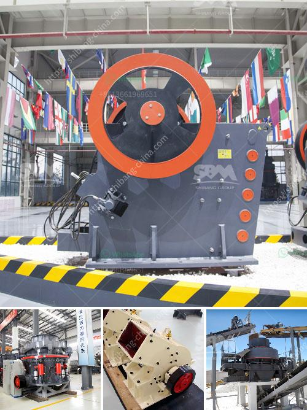

<h3>operation crushing plant</h3>
The operation of crushing plants is crucial in construction projects as it enables the efficient processing of raw materials, ultimately resulting in the creation of a product that is in line with the project specifications. A crushing plant typically consists of a primary crusher, secondary crusher, and screening equipment, ensuring that the crushed rock meets the desired size and quality requirements.

One of the key components of a crushing plant is the primary crusher, which crushes the raw material into smaller fragments. Depending on the hardness and size of the material, different types of primary crushers such as jaw crushers, impact crushers, or gyratory crushers may be used. The primary crusher's role is to reduce the material size for further processing.

After the raw material is initially crushed, it is sent to the secondary crusher for additional refinement. This secondary crushing process further reduces the size of the material, ensuring that it meets the desired specifications. The secondary crusher may be a cone crusher or an impact crusher, depending on the project requirements.

To ensure the final product meets the desired specifications, screening equipment is used to separate the crushed rock into different sizes. This screening process eliminates any oversized or undersized particles, ensuring that only the required size of the material is used. The use of vibrating screens, trommel screens, or deck screens allows for efficient and effective separation.

In conclusion, the operation of a crushing plant is critical in construction projects as it enables the processing of raw materials efficiently. The primary and secondary crushers are responsible for reducing the size of the material, while screening equipment ensures that the final product meets specific size and quality requirements. By employing an efficient crushing plant, construction projects can progress smoothly, meeting the desired specifications and delivering a high-quality end product.
<h3>Contact us</h3><ul><li><strong>Whatsapp:&nbsp;<a href="https://wa.me/8613661969651">+8613661969651</a></strong></li><li><a href="https://swt.shibang-china.com/?git&amp;zhl&amp;operation crushing plant"><strong>Online Service(chat now)</strong></a></li></ul><h3>Related</h3><ul><li><a href='price of dolomite grinding machine stone crusher machine.md'>price of dolomite grinding machine stone crusher machine</a></li><li><a href='small sacle crushers in zambia.md'>small sacle crushers in zambia</a></li><li><a href='russia copper ore crushing plant.md'>russia copper ore crushing plant</a></li><li><a href='quarry crusher machinery for sale.md'>quarry crusher machinery for sale</a></li><li><a href='project report of dolomite powder plant.md'>project report of dolomite powder plant</a></li></ul>