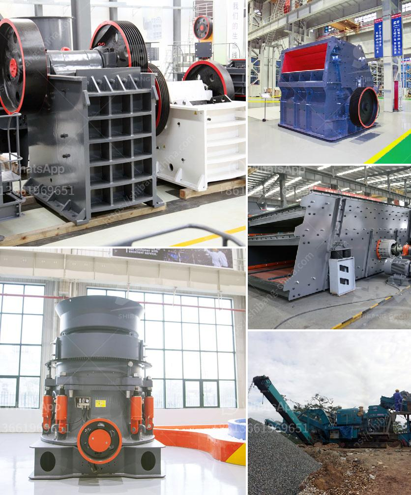

<h3>ore beneficiation plant</h3>
Ore beneficiation is a process that improves the economic value of minerals by removing unwanted impurities. The process relies on the different properties of the minerals to be separated. These properties include magnetic susceptibility, density, color, shape, and other physical and chemical properties of the ore.

Ore beneficiation plants exploit the difference in the mineral properties of ores and impurities to achieve effective separation. As the plant operates, the mineral material is fed into the crushing and grinding equipment, then it is subjected to various beneficiation processes such as gravity separation, magnetic separation, flotation, and electrostatic separation.

The aim of ore beneficiation is to efficiently separate and upgrade the valuable minerals or metals, ensuring their maximum economic value. This process is particularly important for low-grade ores that contain a small amount of valuable minerals among a large amount of impurities. By improving the ore grade, beneficiation plants enhance the economic viability of the mining operation.

One popular type of ore beneficiation plant is the gravity separator. This utilizes the differences in density between minerals to separate them. Other methods that are widely used include magnetic separation, flotation, and electrostatic separation.

Besides improving the ore grade, ore beneficiation plants also reduce waste and protect the environment. By separating the valuable minerals from the impurities, the amount of waste generated during the mining process is greatly reduced. This helps to minimize the impact on land and water resources, as well as reducing the pollution caused by mining activities.

In conclusion, ore beneficiation plants play a crucial role in the mining industry by improving the economic value of minerals through effective separation methods. These plants not only increase the quality of the ores but also reduce waste and protect the environment. With continuous advancements in beneficiation technology, these plants are becoming more efficient and effective in extracting valuable minerals from low-grade ores.
<h3>Contact us</h3><ul><li><strong>Whatsapp:&nbsp;<a href="https://wa.me/8613661969651">+8613661969651</a></strong></li><li><a href="https://swt.shibang-china.com/?git&amp;zhl&amp;ore beneficiation plant"><strong>Online Service(chat now)</strong></a></li></ul><h3>Related</h3><ul><li><a href='how to make copper concentrate.md'>how to make copper concentrate</a></li><li><a href='how to select machines for stone crushing plant.md'>how to select machines for stone crushing plant</a></li><li><a href='dolomite crusher plant in malaysia.md'>dolomite crusher plant in malaysia</a></li><li><a href='granite stone processing plant.md'>granite stone processing plant</a></li><li><a href='used stone crusher machine for sale in philippines.md'>used stone crusher machine for sale in philippines</a></li></ul>