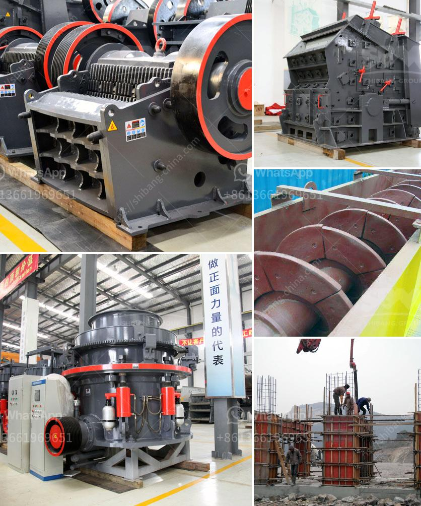

<h3>ore processing plant for sale</h3>
The mining industry plays a significant role in extracting valuable minerals from the earth, contributing to the global economy's growth. Efficient ore processing plants are crucial to optimize the extraction process and enhance mineral profitability. Companies are continually seeking advanced machinery and equipment to improve their processing capabilities. Therefore, the availability of an ore processing plant for sale is a favorable prospect for mining companies aiming to upgrade their facilities.

An ore processing plant serves as a central hub for all the necessary operations, from crushing and grinding ores to extracting valuable minerals. It is essential for the plant to operate effectively and efficiently to maximize the yield and quality of the final products. Upgrading or acquiring a new processing plant can provide numerous advantages for mining companies:

1. Enhanced Efficiency: Advanced processing plants incorporate cutting-edge technologies and equipment, allowing for faster and more efficient ore processing. This leads to increased productivity, reduced processing time, and lower operation costs. The utilization of state-of-the-art machinery ensures optimal performance, minimizing downtime and maximizing overall ore recovery.

2. Improved Sustainability: Modern ore processing plants prioritize sustainability by incorporating eco-friendly practices. These plants utilize energy-efficient equipment and employ recycling methods to reduce waste generation. Implementing sustainable systems not only benefits the environment but also enhances the company's reputation, attracting investors interested in environmentally responsible mining operations.

3. Increased Safety: Safety is a critical aspect of any mining operation, and ore processing plants are no exception. Newer processing plants are designed with enhanced safety features, minimizing the risk of accidents and prioritizing worker well-being. Advanced automation systems reduce the need for manual labor in hazardous areas, protecting workers from potential harm.

4. Better Product Quality: Upgrading to a new ore processing plant allows for improved product quality. Advanced technologies ensure precise control over the processing parameters, resulting in consistent and high-quality end products. Establishing a reputation for superior product quality can lead to increased demand and market competitiveness.

Given the benefits of upgrading or acquiring a new ore processing plant, finding one for sale presents a valuable opportunity for mining companies. Several reputable manufacturers and suppliers offer ore processing plants designed to meet both industry standards and specific project requirements. When looking for an ore processing plant for sale, considering the following factors is crucial:

1. Reliability: The plant's reliability is paramount for uninterrupted processing operations. Research the manufacturer's reputation, read customer reviews, and ensure the plant is built to withstand the specific conditions of your site.

2. Customization Options: Different mining projects have varied processing needs. Look for a plant that offers customization options, allowing you to adapt the processing capabilities to your specific requirements.

3. Maintenance and Support: After-sales support, maintenance services, and spare parts availability are crucial considerations. Ensure the manufacturer provides comprehensive support to address any technical issues and minimize downtime.

4. Cost-effectiveness: Evaluate the investment required for the ore processing plant, considering long-term savings in operational costs and increased profitability.

In conclusion, the availability of an ore processing plant for sale brings promising prospects for mining companies aiming to upgrade their facilities. Investing in an advanced plant enhances efficiency, sustainability, safety, and product quality, ultimately leading to improved profitability. Thoroughly researching potential suppliers and considering essential factors can help companies find the plant that best suits their needs, ensuring a successful and profitable ore processing operation.
<h3>Contact us</h3><ul><li><strong>Whatsapp:&nbsp;<a href="https://wa.me/8613661969651">+8613661969651</a></strong></li><li><a href="https://swt.shibang-china.com/?git&amp;zhl&amp;ore processing plant for sale"><strong>Online Service(chat now)</strong></a></li></ul><h3>Related</h3><ul><li><a href='business plan for clinker grinding plant.md'>business plan for clinker grinding plant</a></li><li><a href='cost for the ball mill machines.md'>cost for the ball mill machines</a></li><li><a href='jaw crusher for sale in malaysia.md'>jaw crusher for sale in malaysia</a></li><li><a href='magnetic separator distributor in surabaya.md'>magnetic separator distributor in surabaya</a></li><li><a href='static jaw crusher and plant for sale.md'>static jaw crusher and plant for sale</a></li></ul>