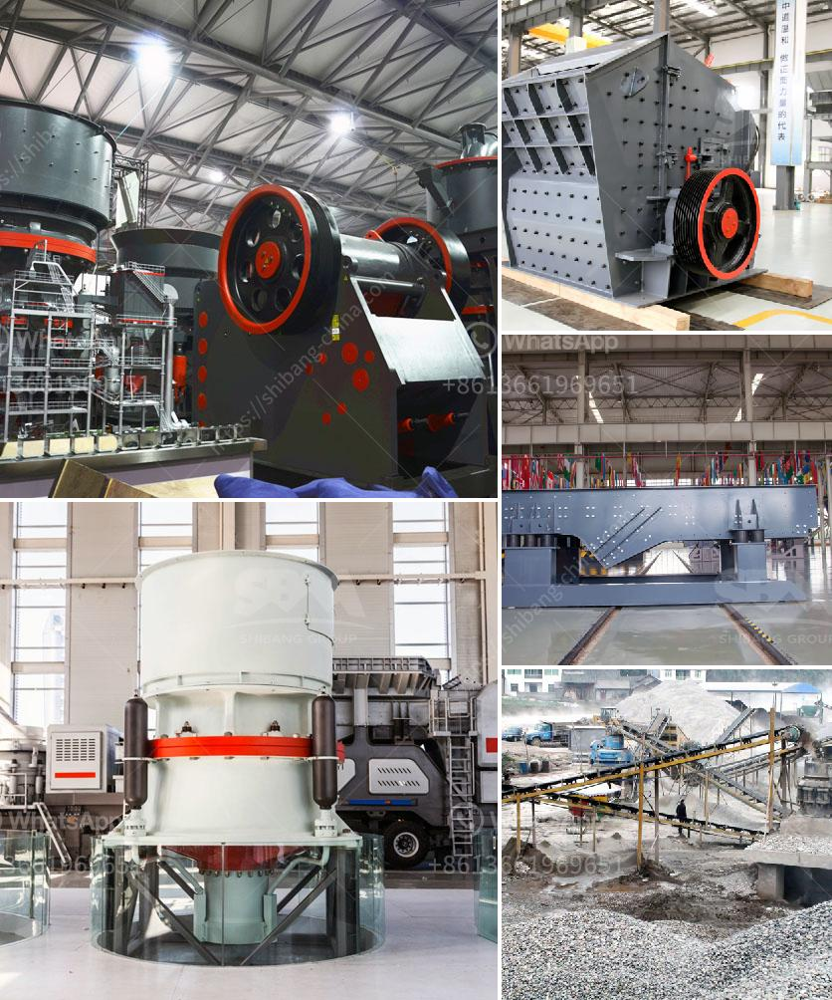

<h3>out used stone crusher in america</h3>
The demand for used stone crushers in America is expected to grow at a steady rate during the forecast period. Over the years, the construction industry has been witnessing a boom in the country, which has led to an increase in the need for construction aggregates, such as crushed stone. As a result, the demand for stone crushers has increased in America.

Stone crushers are used extensively in mining, smelting, building materials, highway construction, railway construction, and water conservancy projects. They are typically used as primary crushers, or the first step in the process of reducing rock. The crushed materials are subsequently used in various construction applications, such as road base, concrete aggregate, and asphalt mixtures.

In America, there is a wide range of used stone crushers available for purchase. These crushers are economical and cost-effective, making them ideal for small-scale crushing projects. Crushers can be used to crush various materials, ranging from hard rocks to softer ones such as limestone, basalt, granite, and more. With the advancement in technology, innovative features have been incorporated into the design of stone crushers, improving their efficiency and usability.

When purchasing a used stone crusher, it is crucial to thoroughly inspect the machine to ensure its reliability and durability. Important factors to consider include the condition of the machine, the potential for wear and tear, and whether it has been properly maintained. It is advisable to consult professionals and rely on trusted suppliers who can provide comprehensive information about the product's history and usage.

Overall, used stone crushers play a significant role in the construction industry in America. They are cost-effective and versatile machines that can be used for various crushing purposes. As the demand for construction aggregates continues to increase, the need for reliable and efficient stone crushers will also grow. With proper care and maintenance, used stone crushers can provide years of reliable service, making them a valuable investment for construction companies and individuals alike.
<h3>Contact us</h3><ul><li><strong>Whatsapp:&nbsp;<a href="https://wa.me/8613661969651">+8613661969651</a></strong></li><li><a href="https://swt.shibang-china.com/?git&amp;zhl&amp;out used stone crusher in america"><strong>Online Service(chat now)</strong></a></li></ul><h3>Related</h3><ul><li><a href='hammer mill in nigeria.md'>hammer mill in nigeria</a></li><li><a href='100tph stone crushing and screening plant.md'>100tph stone crushing and screening plant</a></li><li><a href='stone crushing plant project report doc.md'>stone crushing plant project report doc</a></li><li><a href='crushing plants for sale in sri lanka.md'>crushing plants for sale in sri lanka</a></li><li><a href='used jaw crushers canada.md'>used jaw crushers canada</a></li></ul>