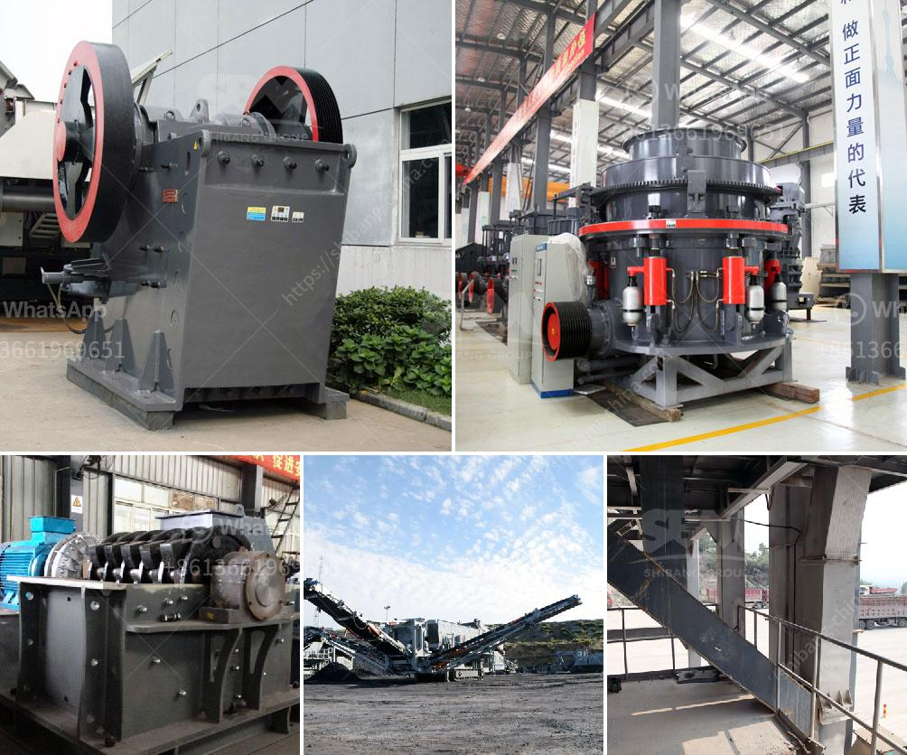

<h3>packing plant in cement industry</h3>
In the cement industry, a packing plant is a crucial facility used for the final stage of cement production. It ensures that the cement is efficiently packed and ready for transport to various construction sites. The packing plant plays a significant role in enhancing the overall efficiency and productivity of a cement manufacturing plant.

One of the main functions of a packing plant is to accurately weigh and pack cement into bags or containers of different sizes. This process is essential to ensure that the cement is conveniently transported and used at construction sites. The packing plant also includes sophisticated equipment, such as conveyors, automatic bagging machines, and robotic palletizers, to enhance the packing process's speed and precision.

Furthermore, the packing plant ensures that the cement is properly sealed to prevent any leakage or contamination during transportation. It usually involves the use of sealing machines and quality control measures to ensure that the bags or containers are tightly sealed before leaving the plant premises. This guarantees that the cement reaches its destination in optimal condition for construction purposes.

Moreover, a packing plant in the cement industry contributes to reducing waste and environmental pollution. By using advanced technologies and automated systems, it minimizes the risk of human error and prevents unnecessary spillage or overpacking. This ensures that the cement is efficiently utilized and reduces the need for excess packaging materials, thus promoting sustainability within the industry.

Overall, the packing plant in the cement industry plays a crucial role in ensuring that cement is packed and transported efficiently. It facilitates the final stage of cement production and guarantees the proper sealing of bags or containers. With its advanced equipment and automated systems, it enhances the overall efficiency and accuracy of the packing process, contributing to reduced waste and environmental impact. Therefore, a well-equipped and well-maintained packing plant is essential for any cement manufacturing plant to meet the demands of the construction industry effectively.
<h3>Contact us</h3><ul><li><strong>Whatsapp:&nbsp;<a href="https://wa.me/8613661969651">+8613661969651</a></strong></li><li><a href="https://swt.shibang-china.com/?git&amp;zhl&amp;packing plant in cement industry"><strong>Online Service(chat now)</strong></a></li></ul><h3>Related</h3><ul><li><a href='stone crusher mobile plant south africa.md'>stone crusher mobile plant south africa</a></li><li><a href='how to make a talcum powder.md'>how to make a talcum powder</a></li><li><a href='single super phosphate plants in germany.md'>single super phosphate plants in germany</a></li><li><a href='mobile iron ore crusher.md'>mobile iron ore crusher</a></li><li><a href='aggregates crushing flow chart process.md'>aggregates crushing flow chart process</a></li></ul>