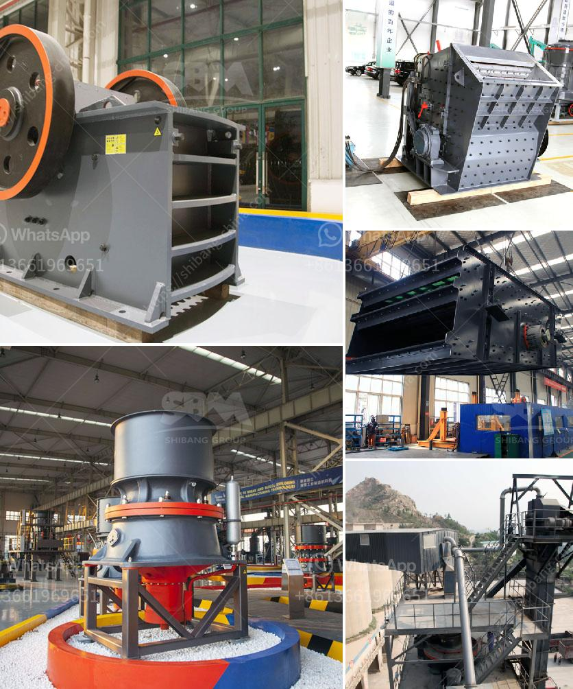

<h3>pakistan copper crusher processing comoanies</h3>
Pakistan, officially known as the Islamic Republic of Pakistan, is a sovereign country in South Asia. It is the fifth-largest country in the world by population and has a rich history and diverse culture. In recent years, Pakistan has been making significant progress in various industries, including the copper mining and processing sector.

Copper is an essential metal widely used in various industries, including construction, electronics, and transportation. Pakistan is blessed with abundant copper reserves, making it an ideal location for copper mining and processing activities. Several companies have established their presence in the country to capitalize on these reserves and contribute to the economic growth of the nation.

One such company is ABC Copper Processing. With years of expertise and state-of-the-art technology, ABC Copper Processing is a leading copper crusher manufacturer and supplier based in Pakistan. The company offers a wide range of copper crushers that are used to crush mined copper ore into small particles for further processing.

ABC Copper Processing's crushers are designed to handle both primary and secondary crushing of copper-bearing rocks. The company's crushers are known for their high efficiency, durability, and reliable performance in harsh operating conditions. They are capable of processing large volumes of copper ore, ensuring maximum productivity and cost-effectiveness.

Another prominent player in the Pakistani copper crusher processing industry is XYZ Industries. With a focus on innovation and sustainability, XYZ Industries is committed to delivering cutting-edge solutions for the mining and processing of copper. The company's crushers are equipped with advanced technologies to ensure optimal performance and reduce environmental impact.

In addition to manufacturing copper crushers, these companies also offer comprehensive support services, including installation, maintenance, and spare parts supply. They strive to establish long-term partnerships with their clients by providing exceptional after-sales service and technical assistance.

The growth of copper mining and processing companies in Pakistan is not only beneficial for the economy but also contributes to the overall development of the country. These companies create job opportunities, facilitate technology transfer, and generate revenue through exports.

In conclusion, Pakistan is home to several copper crusher processing companies that play a significant role in harnessing the country's copper reserves. These companies leverage their expertise and advanced technologies to extract and process copper ore efficiently. Through their continued efforts, they are contributing to the growth and development of Pakistan's mining sector while meeting global demands for copper.
<h3>Contact us</h3><ul><li><strong>Whatsapp:&nbsp;<a href="https://wa.me/8613661969651">+8613661969651</a></strong></li><li><a href="https://swt.shibang-china.com/?git&amp;zhl&amp;pakistan copper crusher processing comoanies"><strong>Online Service(chat now)</strong></a></li></ul><h3>Related</h3><ul><li><a href='stone crushers for sale in south africa.md'>stone crushers for sale in south africa</a></li><li><a href='clinker grinding plant.md'>clinker grinding plant</a></li><li><a href='price for china crusher.md'>price for china crusher</a></li><li><a href='grinding coal mill.md'>grinding coal mill</a></li><li><a href='indonesia coal screen machine.md'>indonesia coal screen machine</a></li></ul>