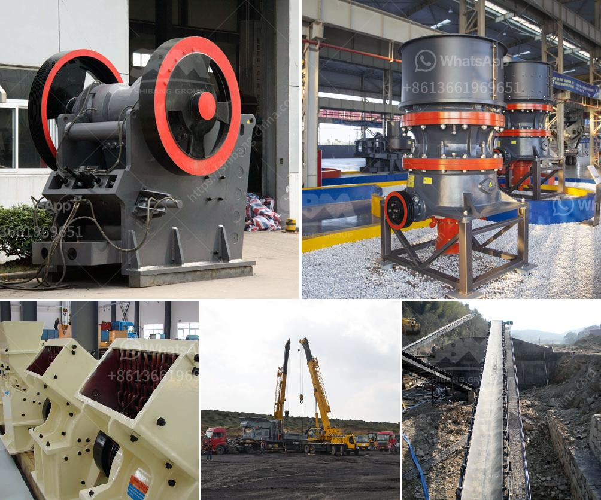

<h3>part of ball mill</h3>
The ball mill is a key equipment for grinding materials, widely used in powder-making production line such as cement, silicate sand, new-type building material, refractory material, fertilizer, ore dressing of ferrous metal and non-ferrous metal, glass ceramics, etc. Ball mill can grind various ores and materials with dry type or wet type.

One of the important parts of the ball mill is the liner. The liners of the ball mill can be divided into manganese steel, high manganese steel, rubber and alloy materials. The service life of the liner of the ball mill is important to the overall working efficiency of the ball mill. Therefore, it is important to select the appropriate liner and ensure its service life.

The two most commonly used liners for ball mills are manganese steel liners and rubber liners. Manganese steel liner is characterized by high rigidity, high strength, strong wear resistance, and good impact resistance. It can be used for a long time without deformation and breakage. However, due to the high cost of manganese steel materials and the time-consuming installation and removal process, it is not suitable for some small and medium-sized ball mills.

Rubber liners have the advantages of low cost, lighter weight, easy replacement, and noise reduction. They can effectively reduce the impact on the cylinder, making the grinding process more stable. Rubber liners are widely used in various types of ball mill to reduce grinding noise and improve grinding efficiency. The main functions of the rubber liner in the ball mill are:

The rubber liner is used to protect the cylinder, avoiding direct impact and friction between the grinding medium and the cylinder. It plays a role in buffering and protecting the cylinder from wear and tear.

Rubber liners can effectively reduce the noise produced during the grinding process, creating a comfortable working environment.

Rubber liners have good wear resistance and impact resistance. They can withstand the impact of steel balls and prolong the service life of the liner.

In conclusion, the liner of the ball mill plays an important role in protecting the cylinder, reducing noise, and improving grinding efficiency. Choosing the suitable liner and ensuring its service life is of great significance to the stable operation and production efficiency of the ball mill. Whether it is the high rigidity and wear resistance of manganese steel liners or the low cost and easy replacement of rubber liners, they are all the choices of ball mill users based on their production needs.
<h3>Contact us</h3><ul><li><strong>Whatsapp:&nbsp;<a href="https://wa.me/8613661969651">+8613661969651</a></strong></li><li><a href="https://swt.shibang-china.com/?git&amp;zhl&amp;part of ball mill"><strong>Online Service(chat now)</strong></a></li></ul><h3>Related</h3><ul><li><a href='stone crushing plant for sale in pakistan.md'>stone crushing plant for sale in pakistan</a></li><li><a href='belt conveyor system manufacturers.md'>belt conveyor system manufacturers</a></li><li><a href='manufactures crushing machines in bolivia.md'>manufactures crushing machines in bolivia</a></li><li><a href='jaw crusher for sale in.md'>jaw crusher for sale in</a></li><li><a href='magnesite ore mining process.md'>magnesite ore mining process</a></li></ul>