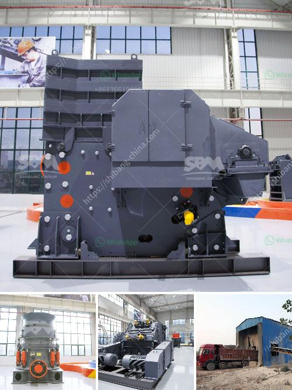

<h3>pe 400 by 600 single toggle jaw crusher specifications</h3>
- Advantages: simple structure, reliable performance, easy maintenance, low operating cost, and strong adaptability.

The PE 400 by 600 single toggle jaw crusher is widely used in many fields such as mining, metallurgy, building materials, highway, railway, water conservancy, and chemical industries. It not only can crush various materials with compressive strength of not more than 320MPa but also can be used for coarse crushing or fine crushing. The PE 400 by 600 single toggle jaw crusher has the features of simple structure, reliable performance, and strong power transmission capacity.

The feed opening of the PE 400 by 600 single toggle jaw crusher is 400mm x 600mm, with an adjustable discharge opening of 40-100mm, and a capacity range of 16-60 tons per hour. This machine is suitable for various materials, such as limestone, granite, marble, basalt, iron ore, river pebbles, construction waste, etc.

Equipped with a 30kw motor, the PE 400 by 600 single toggle jaw crusher has enough power to crush even the hardest materials. Its high rotation speed of the eccentric shaft ensures efficient crushing operation. The simple structure of the jaw crusher makes it easy to maintain and operate, and the low operating cost makes it an affordable option for many users.

In conclusion, the PE 400 by 600 single toggle jaw crusher is a simple and reliable machine that can provide high crushing efficiency and low operating costs. With its wide range of applications and adaptability, it is an ideal choice for various industrial sectors. Whether for small-scale mining or large-scale construction projects, this jaw crusher can meet the crushing requirements with ease.
<h3>Contact us</h3><ul><li><strong>Whatsapp:&nbsp;<a href="https://wa.me/8613661969651">+8613661969651</a></strong></li><li><a href="https://swt.shibang-china.com/?git&amp;zhl&amp;pe 400 by 600 single toggle jaw crusher specifications"><strong>Online Service(chat now)</strong></a></li></ul><h3>Related</h3><ul><li><a href='hammer mill for limestone in south africa.md'>hammer mill for limestone in south africa</a></li><li><a href='conveyor belts for sale philippines.md'>conveyor belts for sale philippines</a></li><li><a href='manufacturing process process calcium carbonate.md'>manufacturing process process calcium carbonate</a></li><li><a href='crusher price jaw crusher prices.md'>crusher price jaw crusher prices</a></li><li><a href='calcium carbonate mines in pakistan.md'>calcium carbonate mines in pakistan</a></li></ul>