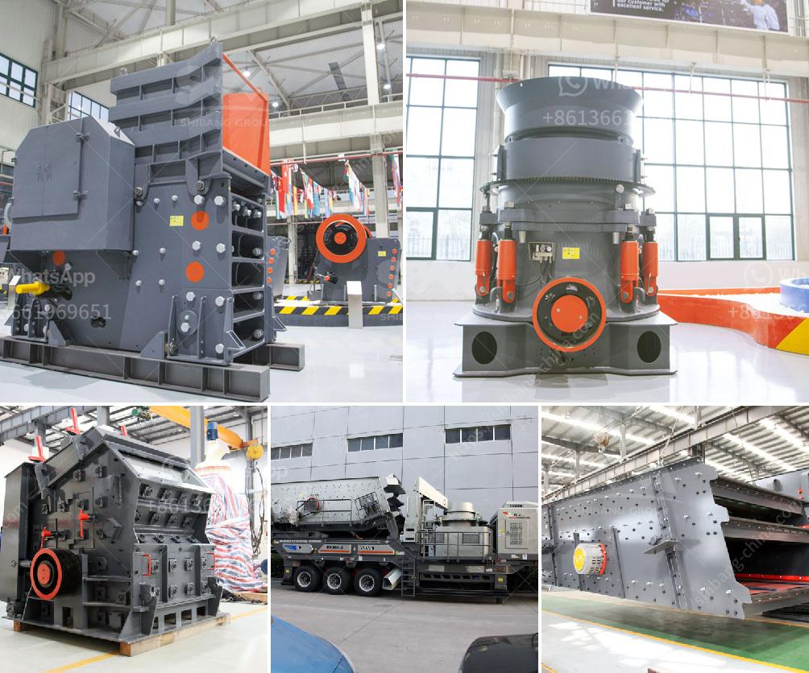

<h3>pe 400 jaw crusher</h3>
The PE 400 Jaw Crusher is a versatile and powerful machine that is designed to meet the crushing needs of various industries. It is widely used in mining, metallurgy, building materials, highways, railways, water conservancy and chemical industries.

This machine has a compact design, and it is easy to transport and install. It has a deep crushing cavity and a large feed opening, which allows it to handle larger rocks and materials with high hardness. The adjustable discharge opening allows users to control the size of the final product, making it suitable for different applications.

The PE 400 Jaw Crusher has a motor power of 30 kw and an input energy of 280-320 t/h. It has a processing capacity of 16-64 t/h and a maximum feeding size of 350-730 mm, making it suitable for a variety of materials. The adjustable jaw setting provides greater flexibility and allows users to maximize productivity and reduce downtime.

In addition, this machine is easy to maintain. The crusher is equipped with a hydraulic overload protection system, which prevents damage caused by foreign objects or the overload of materials. The machine is also equipped with a centralized lubrication system, which ensures the smooth operation of the equipment and extends its service life.

Overall, the PE 400 Jaw Crusher is a highly efficient, user-friendly, and easy-to-maintain machine that provides excellent crushing performance. It is widely used in various industries, and it is an ideal choice for crushing rocks and materials with high hardness.
<h3>Contact us</h3><ul><li><strong>Whatsapp:&nbsp;<a href="https://wa.me/8613661969651">+8613661969651</a></strong></li><li><a href="https://swt.shibang-china.com/?git&amp;zhl&amp;pe 400 jaw crusher"><strong>Online Service(chat now)</strong></a></li></ul><h3>Related</h3><ul><li><a href='jaw crusher plant 20 tph.md'>jaw crusher plant 20 tph</a></li><li><a href='jaw crusher structure.md'>jaw crusher structure</a></li><li><a href='proposal for sand crushing machines industry.md'>proposal for sand crushing machines industry</a></li><li><a href='3 mesh vibrating screen.md'>3 mesh vibrating screen</a></li><li><a href='cost of tph stage crushing plant.md'>cost of tph stage crushing plant</a></li></ul>