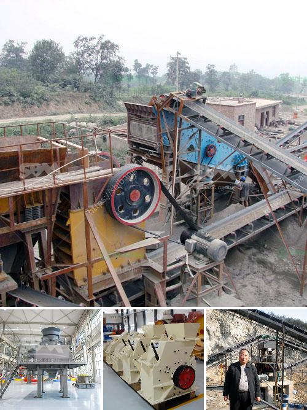

<h3>pe 500 750 jaw crusher price</h3>
The company has rich experience in manufacturing various large and medium-sized crushing equipment including jaw crushers, cone crushers, and impact crushers. As the most commonly used stone crusher, jaw crusher has successfully provided a good foundation for the development of mining, construction, road, railway, water conservancy and other industrial sectors. With the rapid development of the construction industry, the demand for aggregates of sand and gravel is increasing. However, many users are faced with choosing a suitable jaw crusher model from numerous types of equipment.

PE 500*750 jaw crusher is a kind of small jaw crusher. With power conservation about 15%-30% and discharging size less than 50mm, the PE 500*750 jaw crusher is mainly for coarse crushing. PE 500*750 jaw crusher can effectively crush hard materials like drill iron alloy, calcium, silicon carbide, artificial crystal alloy, silicon, chromium iron, boron iron and copper smelting slag, etc.

Pe500*750 jaw crusher can effectively crush hard materials like pebble, granite, quartz, basalt, diabase, etc. Gneiss and granite are harder rocks, so the wear parts of PE 500*750 jaw crusher are more easily damaged. Therefore, adopting high-quality materials and advanced technology can prolong the service life of PE 500*750 jaw crusher. The main components of PE 500*750 jaw crusher are bracket, movable jaw plate, fixed jaw plate, spring, eccentric shaft, toggle plate, movable jaw pulley, etc.

The price of the specific crusher model is subject to consultation. Users can consult online or call the manufacturer for reference. In addition to the price of a specific crusher model, they will comprehensively consider factors such as capacity, feeding size, discharge size, working principle and equipment quality. To choose affordable manufacturers, quality, and after-sales service, PE 500*750 jaw crusher equipment is, indeed, a good choice!  

In conclusion, if you need to buy a new jaw crusher, please click on the 24-hour online customer service or call the hotline directly. The quote will be provided immediately according to your requirements. We are looking forward to your inquiry!
<h3>Contact us</h3><ul><li><strong>Whatsapp:&nbsp;<a href="https://wa.me/8613661969651">+8613661969651</a></strong></li><li><a href="https://swt.shibang-china.com/?git&amp;zhl&amp;pe 500 750 jaw crusher price"><strong>Online Service(chat now)</strong></a></li></ul><h3>Related</h3><ul><li><a href='mobile crusher malaysia.md'>mobile crusher malaysia</a></li><li><a href='cement clinker grinding plant in india.md'>cement clinker grinding plant in india</a></li><li><a href='river stone crusher.md'>river stone crusher</a></li><li><a href='small stone crushers.md'>small stone crushers</a></li><li><a href='limestone processing crusher.md'>limestone processing crusher</a></li></ul>