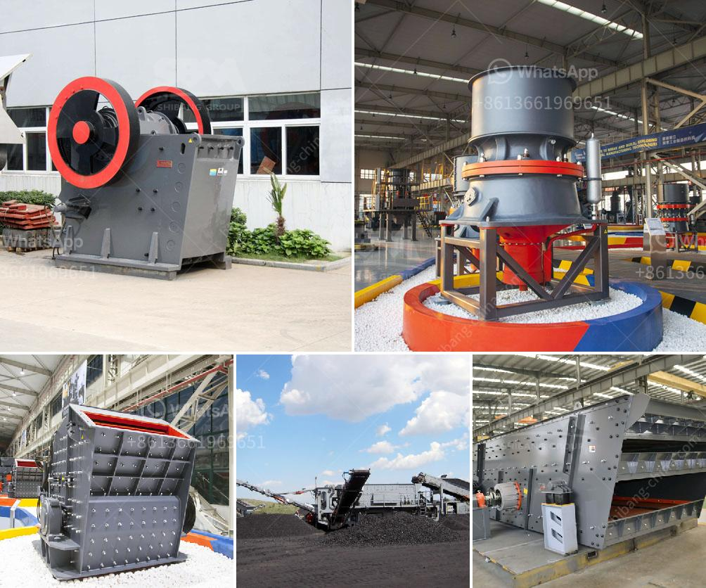

<h3>pebbel stone crusher</h3>
Pebble stone crusher, as a kind of machine, involves the process of crushing material into smaller pieces, thus giving way to diverse uses of pebbles. Pebbles are a naturally occurring resource that has been used for various purposes from ancient times. People have used pebbles for landscaping, construction, and artistic endeavors as well.

The usage of pebbles in landscaping can be traced back to the ancient Greeks, who used pebbles to create mosaics, decorate fountains, and beautify gardens. The smooth and rounded appearance of pebbles adds a unique aesthetic appeal to any outdoor space. Many homeowners and designers utilize pebbles in pathways, driveways, and garden borders to create an elegant and serene environment.

When it comes to construction, pebbles can be used as aggregate in concrete and other building materials. The compact and durable nature of pebbles makes them an excellent choice for constructing driveways, patios, and retaining walls. The diverse range of colors and sizes available in pebbles also allows for creative and eye-catching designs in architectural projects.

Apart from landscaping and construction, pebbles have gained popularity in the art industry. Artists and craftsmen use pebbles to create stunning sculptures, jewelry, and decorative items. The natural and unique patterns found on pebbles make them a perfect medium for artistic expression.

To meet the growing demand for pebbles, the role of pebble stone crushers is essential. These machines crush the pebbles into smaller sizes for various uses. The demand for pebble stone crushers has increased significantly due to its wide range of application.

One of the primary reasons why pebble stone crushers are popular in diverse industries is the flexibility they offer. The machines can be customized to meet specific requirements of customers, be it in terms of size, capacity, or features. Additionally, pebble stone crushers are capable of crushing materials with compressive strength up to 320MPa, making them durable and powerful to handle even the hardest stones.

Moreover, pebble stones are readily available in nature, making the crushers even more sustainable and environmentally friendly. The process of crushing pebble stones does not require extensive mining, reducing the environmental impact associated with such activities.

In conclusion, the pebble stone crusher is a valuable machine that has wide application in the industrial and construction industries alike. This crusher machine is an integral part of diverse industries and plays an essential role in efficiently crushing different types of raw materials to produce useful products.
<h3>Contact us</h3><ul><li><strong>Whatsapp:&nbsp;<a href="https://wa.me/8613661969651">+8613661969651</a></strong></li><li><a href="https://swt.shibang-china.com/?git&amp;zhl&amp;pebbel stone crusher"><strong>Online Service(chat now)</strong></a></li></ul><h3>Related</h3><ul><li><a href='100tph used crusher plant for sale.md'>100tph used crusher plant for sale</a></li><li><a href='manufacturers of stone crushers in usa.md'>manufacturers of stone crushers in usa</a></li><li><a href='process flow gold copper mining.md'>process flow gold copper mining</a></li><li><a href='companies of panama conveyor belts.md'>companies of panama conveyor belts</a></li><li><a href='gold processing company china.md'>gold processing company china</a></li></ul>