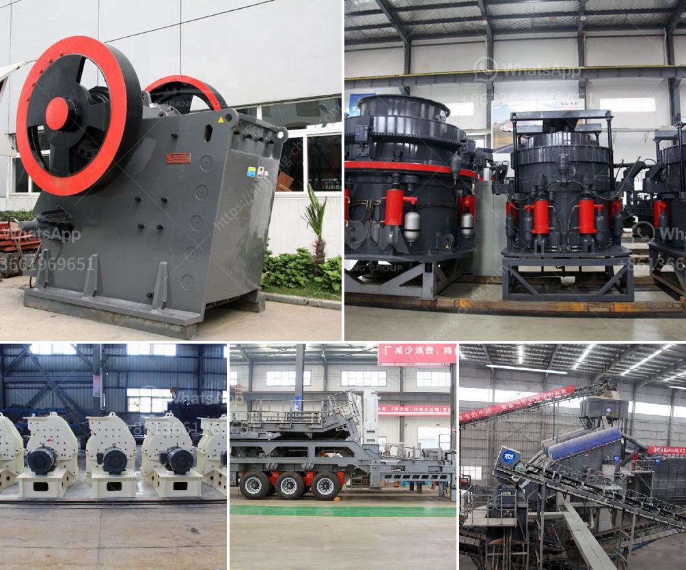

<h3>pebble crusher for grinding mill</h3>
With the increasing demand for finer grinding, many mines are turning to pebble crushers to increase production and achieve desired product size. Pebble crushers are a reliable and effective way to reduce oversized rock fragments, protect mills from damage, and improve production capacity. The use of pebble crushing can also help improve overall operational efficiency.

Pebble crushers are primarily used in semi-autogenous grinding (SAG) mill circuits, but they can also be used in secondary crushing to reduce the feed size ahead of a ball mill. Pebble crushers typically reduce the feed to a product size range of 25 mm to 75 mm, with the goal of efficiently producing a final product size that is closely sized to the target grind size.

One of the key advantages of a pebble crusher is its ability to handle a wide range of feed sizes. Unlike conventional crushers that require a fixed gap setting, pebble crushers can be set to different settings to achieve different product sizes. This versatility allows operators to quickly adjust the crusher based on the characteristics of the ore being processed. By controlling the crusher settings, operators can optimize the process and improve the overall efficiency of the grinding circuit.

In addition to size reduction, pebble crushers play a crucial role in protecting the mill from damage. Oversized rocks and tramp metal can cause significant damage to mill liners and other components, leading to costly repairs and downtime. Pebble crushers serve as a critical line of defense, preventing these oversized fragments from entering the mill and causing damage. By reducing the size of the feed material, pebble crushers help ensure a smooth and efficient operation of the grinding circuit.

Another advantage of pebble crushers is their ability to handle harder and more abrasive ores. Traditional crushers such as jaw crushers or cone crushers may struggle with hard and abrasive ores, leading to excessive wear and reduced operational lifespan. Pebble crushers, on the other hand, are designed to handle tough ores and provide high wear resistance. This makes them ideal for crushing harder and more abrasive materials, improving overall process efficiency and reducing maintenance costs.

Overall, pebble crushers offer a reliable and versatile crushing solution for grinding mills. They provide operators with the ability to control and optimize the size reduction process, protect the mill from damage, and handle tough and abrasive ores. By incorporating pebble crushing into their operations, mines can increase production capacity, improve product size control, and enhance overall operational efficiency. Furthermore, the use of pebble crushers can help reduce energy consumption, as finer grinding requires less energy compared to coarser grinding.

As the demand for finer grinding and higher production capacity continues to grow, having a reliable crushing solution like a pebble crusher is becoming increasingly important. With their versatility, durability, and ability to handle various ore types, pebble crushers are a valuable addition to any grinding circuit. Whether used in primary or secondary crushing, pebble crushers can play a significant role in improving the overall performance and profitability of the mine.
<h3>Contact us</h3><ul><li><strong>Whatsapp:&nbsp;<a href="https://wa.me/8613661969651">+8613661969651</a></strong></li><li><a href="https://swt.shibang-china.com/?git&amp;zhl&amp;pebble crusher for grinding mill"><strong>Online Service(chat now)</strong></a></li></ul><h3>Related</h3><ul><li><a href='mining process for perlite.md'>mining process for perlite</a></li><li><a href='crusher stone manufacture from china.md'>crusher stone manufacture from china</a></li><li><a href='vsi crusher plants in uae.md'>vsi crusher plants in uae</a></li><li><a href='russia equipment manufacturers mining.md'>russia equipment manufacturers mining</a></li><li><a href='calcium carbonate multiplication process.md'>calcium carbonate multiplication process</a></li></ul>