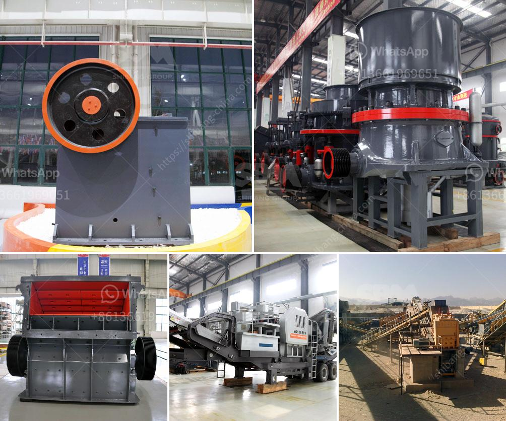

<h3>plant crushing materials in antioquia</h3>
Plant Crushing Materials in Antioquia: A Sustainable Solution for Construction and Infrastructure Development

Antioquia, a department located in the northwest region of Colombia, is renowned for its rich natural resources and immense potential for economic development. In recent years, there has been a growing emphasis on sustainable construction practices and infrastructure development within the region. One key factor that has contributed to this shift is the establishment of plant crushing materials, which has proven to be a game-changer in the construction industry.

Plant crushing materials refer to facilities equipped with machinery and equipment designed to crush raw materials such as rocks, stones, and concrete into usable aggregates and building materials. These materials are then utilized in various construction projects, from road construction to building foundations.

The establishment of plant crushing materials in Antioquia has brought numerous benefits to the region's construction industry. Firstly, it has addressed the issue of scarcity of construction materials. In the past, construction projects often faced delays and cost overruns due to limited access to raw materials. With plant crushing materials, the reliance on traditional quarries has significantly reduced. Construction companies now have a reliable and sustainable source of aggregates, ensuring smooth operations and timely project completion.

Moreover, plant crushing materials contribute to the region's commitment to environmental sustainability. Traditional mining practices often result in the destruction of natural habitats, significant emissions of pollutants, and the depletion of natural resources. In contrast, plant crushing materials operate within a closed-loop system, where the materials are recycled and reused. This significantly reduces the environmental impact associated with conventional mining practices. Additionally, the machinery used in crushing plants is generally powered by energy-efficient systems, further minimizing the carbon footprint of the construction industry in Antioquia.

Furthermore, plant crushing materials offer economic advantages to the region. By utilizing recycled aggregates, construction companies can significantly reduce their material costs, resulting in more competitive bidding and cost-effective infrastructure development. Additionally, the establishment of these plants has created employment opportunities for local communities, driving economic growth and supporting sustainable livelihoods.

The impact of plant crushing materials is not limited to the construction industry alone. It also benefits the transportation sector by providing better-quality aggregates for road construction and maintenance. The use of recycled aggregates leads to more durable and long-lasting road surfaces, reducing the need for frequent repairs and lowering maintenance costs. Furthermore, the improved quality of road infrastructure enhances connectivity within the region, facilitating trade and tourism while improving overall transportation efficiency.

In conclusion, the establishment of plant crushing materials in Antioquia has revolutionized the construction industry and infrastructure development within the region. It addresses the scarcity of construction materials, promotes environmental sustainability, and offers economic advantages to both the construction and transportation sectors. As Antioquia continues to strive for sustainable growth, plant crushing materials prove to be a vital component, ensuring a bright and thriving future for the region's construction industry.
<h3>Contact us</h3><ul><li><strong>Whatsapp:&nbsp;<a href="https://wa.me/8613661969651">+8613661969651</a></strong></li><li><a href="https://swt.shibang-china.com/?git&amp;zhl&amp;plant crushing materials in antioquia"><strong>Online Service(chat now)</strong></a></li></ul><h3>Related</h3><ul><li><a href='crusher machine for unit.md'>crusher machine for unit</a></li><li><a href='ball mill grinding and particle.md'>ball mill grinding and particle</a></li><li><a href='quartz plants in india.md'>quartz plants in india</a></li><li><a href='how to make a vibrating screen.md'>how to make a vibrating screen</a></li><li><a href='used jaw crushers canada.md'>used jaw crushers canada</a></li></ul>