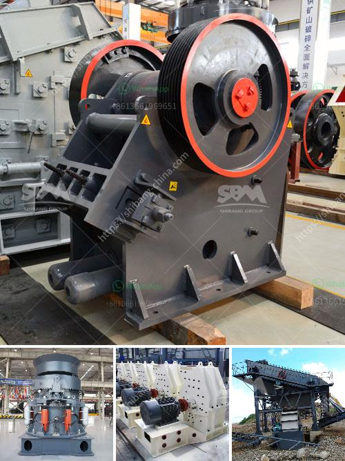

<h3>plant of bentonite crusher</h3>
The utilization of bentonite as a binding agent in various industries is skyrocketing due to its numerous beneficial properties. One of the key applications of bentonite is in the manufacturing of crusher equipment. Bentonite crusher is primarily used to crush and grind bentonite, creating raw materials for the steel and iron industry, as well as the petroleum industry.

During the crushing process, the jaw crusher, cone crusher, and impact crusher perform as a whole to process the raw materials into required sizes. The bentonite particles that pass through the screen are fed into a roller mill, which further grinds them into a fine powder for use in various applications. With the booming demand for bentonite, the market for bentonite crushers is also expanding rapidly.

A bentonite crusher has a wide range of applications. In industries such as metallurgy, mining, and construction, it helps reduce medium and high hardness materials such as granite, limestone, and river stones. It is used as a primary and secondary crusher, which includes a cone crusher, vibrating screen, and impact crusher or jaw crusher.

The market for bentonite crusher is expected to experience a strong growth trajectory over the coming years. Rapid industrialization, coupled with the increasing infrastructure activities in developing countries such as China and India, are the primary driving forces behind the rise in the market.

As urbanization and industrialization continue to accelerate, the demand for bentonite will rise significantly. This will boost the sales of bentonite crushers, driving sustainable growth in the market. Moreover, various governments are focusing on improving infrastructure, which will further increase the demand for bentonite for construction purposes.

Apart from its widespread use in the steel and iron industry, bentonite finds applications in various other sectors. For instance, it is used in agriculture as a soil amendment, in water treatment plants as an absorbent material, and in the pharmaceutical industry as a binder in tablets and capsules. All these industries require crushers specifically designed to crush and grind bentonite into the desired form.

With the rising demand for bentonite crushers, manufacturers are investing in advanced technologies to enhance production capabilities. They are also focusing on developing crushers that are environmentally friendly and energy-efficient. Additionally, manufacturers are adopting innovative marketing strategies to expand their customer base and gain a competitive edge in the market.

The plant of bentonite crusher incorporates various processes, such as crushing, grinding, and classification. The raw bentonite material is pre-crushed to 20mm using a primary jaw crusher. The crushed bentonite is then mixed with calcium carbonate (CaCO3) and a binder in the blender. After the blender process, hydraulic press is regularly used for various tasks such as molding bricks, drying bricks, and cooling bricks. The final product is a high-quality bentonite powder ready for manufacturing and industrial applications.

Overall, the expanding market for bentonite crushers reflects the growing demand for bentonite in various industries. The combination of increasing industrialization, infrastructural development, and technological advancements will continue to drive the market for bentonite crushers in the coming years. The focus on sustainable and energy-efficient crushers will pave the way for a more environmentally friendly future.
<h3>Contact us</h3><ul><li><strong>Whatsapp:&nbsp;<a href="https://wa.me/8613661969651">+8613661969651</a></strong></li><li><a href="https://swt.shibang-china.com/?git&amp;zhl&amp;plant of bentonite crusher"><strong>Online Service(chat now)</strong></a></li></ul><h3>Related</h3><ul><li><a href='stone sand making machine.md'>stone sand making machine</a></li><li><a href='basalt production machinery.md'>basalt production machinery</a></li><li><a href='hammer mill in nigeria.md'>hammer mill in nigeria</a></li><li><a href='granite crusher machine philippines.md'>granite crusher machine philippines</a></li><li><a href='small sacle crushers in zambia.md'>small sacle crushers in zambia</a></li></ul>