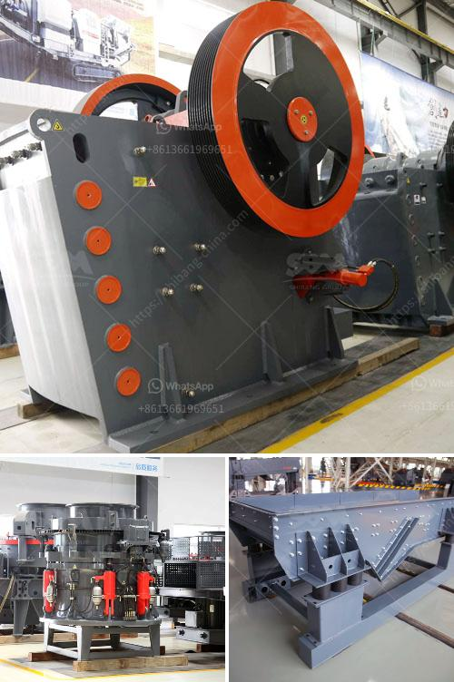

<h3>plant of quartz poweder is salling out</h3>
Quartz, a component of various minerals and one of the most abundant minerals on Earth, has become an integral part of our lives. Its multitude of applications in various industries, including construction, electronics, and even energy, has skyrocketed its demand in recent years. As a result, plants focusing on quartz powder production have flourished, with sales surpassing expectations and inventories selling out faster than ever before.

Quartz powder, a finely ground form of quartz, is widely used as a raw material in the manufacturing of glass, ceramics, paints, and even semiconductors. Its physical and chemical properties, including its heat and electrical resistance, have made it a top choice for industrial processes worldwide. As industries continue to grow and evolve, the demand for this versatile material has reached unprecedented heights, leading to an exponential rise in the establishment of quartz powder plants.

The thriving market for quartz powder can be attributed to several reasons. First and foremost, the construction industry, a major consumer of quartz powder, has experienced rapid expansion in emerging economies. Developing countries, such as India, China, and Brazil, have witnessed an impressive surge in infrastructure projects and urbanization, requiring vast quantities of construction materials. Given the durability and aesthetic appeal of quartz, it has become a preferred component in these projects, driving the demand for its powder.

Moreover, the electronics industry has also played a significant role in the growing demand for quartz powder. With advancements in technology, the manufacturing of electronic devices has become more complex and sophisticated. Quartz powder plays a crucial role in creating microchips and other semiconductor devices due to its unique electrical properties. As the electronics sector continues to evolve, the demand for quartz powder increases.

Additionally, the global shift towards renewable energy sources has amplified the need for quartz powder. Solar panels, an essential component in harnessing solar energy, require quartz powder for their production. As governments and organizations worldwide strive to reduce their carbon footprint, the demand for solar energy and, consequently, quartz powder has seen a steep rise.

The increasing demand for quartz powder has led to the establishment of numerous plants dedicated to its production. These plants utilize advanced machinery and cutting-edge technologies to extract and process quartz into a finely ground powder. They adhere to stringent quality control measures to meet the diverse requirements of different industries. However, even with the rapid expansion of these plants, inventories are selling out faster than suppliers can keep up, resulting in increased investment and expansion plans.

The surge in demand for quartz powder has not only sparked economic growth but also generated employment opportunities. These plants require skilled labor for operating machinery, quality control, and ensuring a smooth production process. As a result, they contribute to the local economy and provide job security for workers in these regions.

As the world continues to advance technologically and environmentally, the demand for quartz powder is expected to soar even higher. The growth projections for the construction, electronics, and renewable energy industries remain positive, indicating sustained demand for quartz powder in the coming years. As a result, the plants dedicated to its production will strive to meet the rising demand, ensuring that inventories sell out faster than ever before.

In conclusion, the thriving market for quartz powder has led to the establishment of numerous plants specializing in its production. These plants cater to the growing demand from industries such as construction, electronics, and renewable energy. With its widespread applications, quartz powder has become an indispensable raw material, driving sales and prompting the expansion of these plants. The future looks promising for the quartz powder industry, as it continues to contribute to economic growth and technological advancements globally.
<h3>Contact us</h3><ul><li><strong>Whatsapp:&nbsp;<a href="https://wa.me/8613661969651">+8613661969651</a></strong></li><li><a href="https://swt.shibang-china.com/?git&amp;zhl&amp;plant of quartz poweder is salling out"><strong>Online Service(chat now)</strong></a></li></ul><h3>Related</h3><ul><li><a href='used crusher stone sale tanzania.md'>used crusher stone sale tanzania</a></li><li><a href='difference between css or oss crusher.md'>difference between css or oss crusher</a></li><li><a href='calculate costs of crushing limestone.md'>calculate costs of crushing limestone</a></li><li><a href='used vertical grinding machine.md'>used vertical grinding machine</a></li><li><a href='gypsum recycling machines for sale.md'>gypsum recycling machines for sale</a></li></ul>