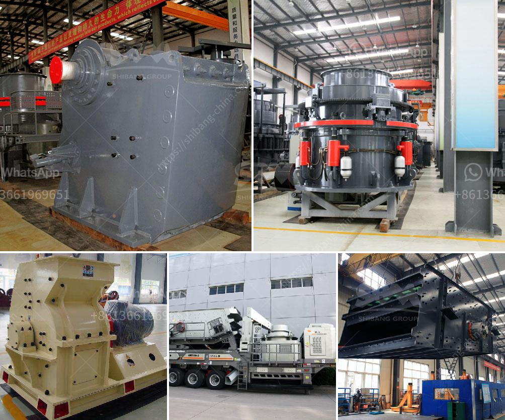

<h3>portable concrete crushers</h3>
Portable concrete crushers are a convenient and cost-effective solution for recycling construction waste and demolition debris. These machines can process raw materials such as concrete, bricks, stones, and other materials into aggregated sizes suitable for multiple applications, such as road construction, landscaping, and manufacturing of new concrete.

One of the key advantages of using portable concrete crushers is their compact size and mobility. These machines are designed to be easily transported and can be set up and operational on-site within minutes. This eliminates the need for additional equipment and transportation costs associated with traditional crushers.

Another significant benefit of using portable concrete crushers is their ability to process materials directly on-site. Instead of hauling debris to a landfill or recycling facility, contractors can crush the materials at the job site, reducing transportation and disposal costs. Additionally, on-site crushing helps to reduce the environmental impact by reducing the amount of waste sent to landfills.

Portable concrete crushers are also highly efficient in terms of throughput. These machines are equipped with powerful crushers that can quickly and effectively process large quantities of material. With adjustable jaw openings and output sizes, contractors can customize the size of the final product to meet specific project requirements.

Furthermore, portable concrete crushers are designed to be easy to operate and maintain, even for inexperienced users. These machines are equipped with user-friendly controls and safety features to ensure safe and efficient operation. Regular servicing and maintenance are also straightforward, ensuring minimal downtime and maximizing productivity.

In conclusion, portable concrete crushers offer numerous benefits for contractors and construction companies. From cost savings and environmental sustainability to increased efficiency and convenience, these machines are an essential tool for any job site. Whether it's recycling construction waste or producing aggregates for new projects, portable concrete crushers are a valuable asset for any construction operation.
<h3>Contact us</h3><ul><li><strong>Whatsapp:&nbsp;<a href="https://wa.me/8613661969651">+8613661969651</a></strong></li><li><a href="https://swt.shibang-china.com/?git&amp;zhl&amp;portable concrete crushers"><strong>Online Service(chat now)</strong></a></li></ul><h3>Related</h3><ul><li><a href='granite milling unit.md'>granite milling unit</a></li><li><a href='cost in india of 100 ton mobile limestone crusher.md'>cost in india of 100 ton mobile limestone crusher</a></li><li><a href='artificial sand machine.md'>artificial sand machine</a></li><li><a href='indonesia coal screen machine.md'>indonesia coal screen machine</a></li><li><a href='hammer mill supplier in pretoria.md'>hammer mill supplier in pretoria</a></li></ul>