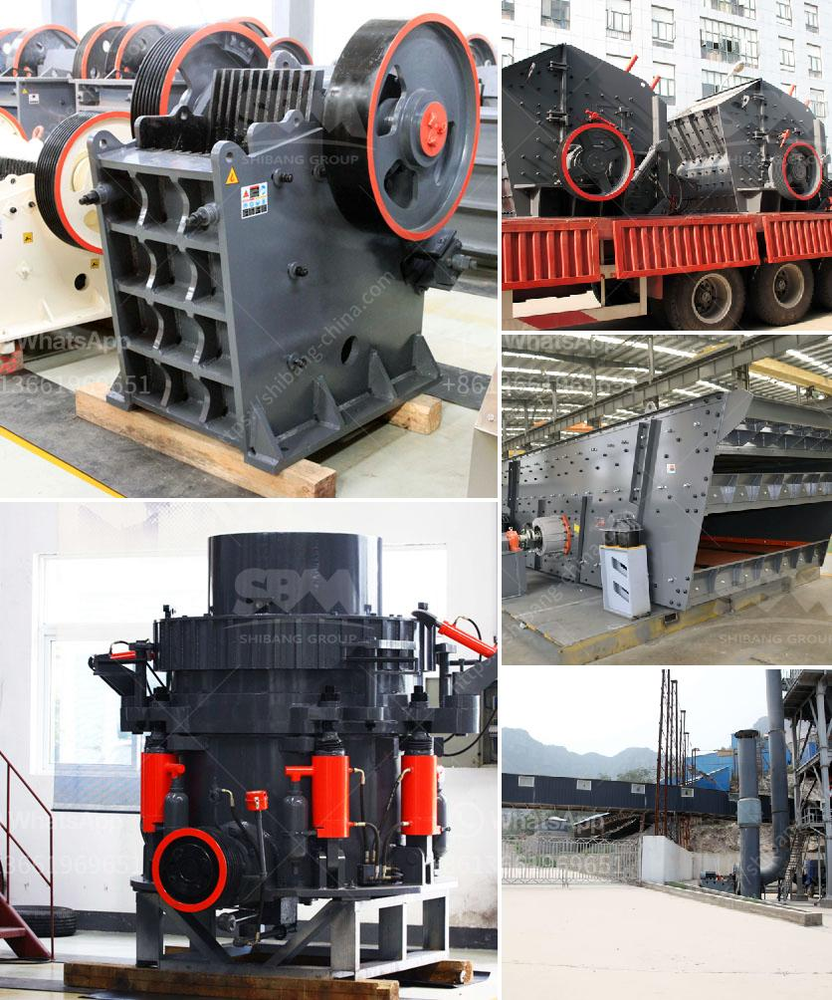

<h3>portable crushing machine from spain</h3>
In today's increasingly connected world, the demand for portable machinery is on the rise. One such machine that has been gaining popularity is the portable crushing machine. With its ability to efficiently and quickly crush various materials, this machine has become an essential tool for many industries. Spain, known for its technological advancements, has emerged as a leading manufacturer of portable crushing machines, providing high-quality solutions to meet the ever-growing global demand.

Portable crushing machines are designed to reduce the size of large rocks and other materials into smaller, more manageable pieces. These machines are commonly used in construction sites, mining operations, and recycling facilities. By crushing materials onsite, these machines eliminate the need for transportation to remote locations, saving time and costs.

Spanish manufacturers have excelled in producing portable crushing machines that offer numerous benefits. One of the key advantages is their compact size and mobility. These machines are designed to be easily transported from one location to another, allowing for greater flexibility and increased efficiency. Whether it's a remote construction site or a quarry deep in the mountains, these machines can be easily set up and operated.

Additionally, portable crushing machines from Spain are known for their durability and high productivity. Built with robust materials and advanced technology, these machines can handle even the toughest materials, including concrete, asphalt, and demolition debris. With various crushing chambers and adjustable settings, these machines can produce a wide range of different-sized materials, meeting the specific needs of each project.

One of the standout features of portable crushing machines from Spain is their environmental friendliness. These machines are equipped with advanced dust suppression systems that minimize dust emissions during operation. This not only improves the health and safety of workers but also helps meet environmental regulations. Furthermore, many Spanish manufacturers focus on incorporating eco-friendly materials and technologies into their machines, making them sustainable choices for businesses and contractors.

In terms of cost-effectiveness, portable crushing machines from Spain offer significant advantages. By crushing materials onsite, businesses can save on transportation costs and avoid the need for additional machinery. The versatility of these machines also means they can be used for multiple applications, further maximizing their value. With minimal maintenance requirements and high operational efficiency, these machines help businesses achieve a rapid return on investment.

When it comes to selecting a portable crushing machine, it is crucial to choose a reliable manufacturer. Spanish manufacturers have gained a reputation for producing high-quality machines that deliver exceptional performance and durability. By choosing a machine from a reputable manufacturer, businesses can ensure they are investing in a reliable and long-lasting solution.

In conclusion, the demand for portable crushing machines has surged in recent years, driven by the need for efficient and cost-effective solutions in various industries. Spain has emerged as a leading manufacturer of these machines, offering compact, powerful, and environmentally friendly solutions. With their mobility, durability, and versatility, portable crushing machines from Spain are revolutionizing the way materials are processed, making them a must-have tool for businesses worldwide.
<h3>Contact us</h3><ul><li><strong>Whatsapp:&nbsp;<a href="https://wa.me/8613661969651">+8613661969651</a></strong></li><li><a href="https://swt.shibang-china.com/?git&amp;zhl&amp;portable crushing machine from spain"><strong>Online Service(chat now)</strong></a></li></ul><h3>Related</h3><ul><li><a href='5 micron grinding mill.md'>5 micron grinding mill</a></li><li><a href='raymond mill crusher price.md'>raymond mill crusher price</a></li><li><a href='graphite mining equipment in madagascar suppliers.md'>graphite mining equipment in madagascar suppliers</a></li><li><a href='crusher for limestone.md'>crusher for limestone</a></li><li><a href='iron ore crushing plant in germany crusher.md'>iron ore crushing plant in germany crusher</a></li></ul>