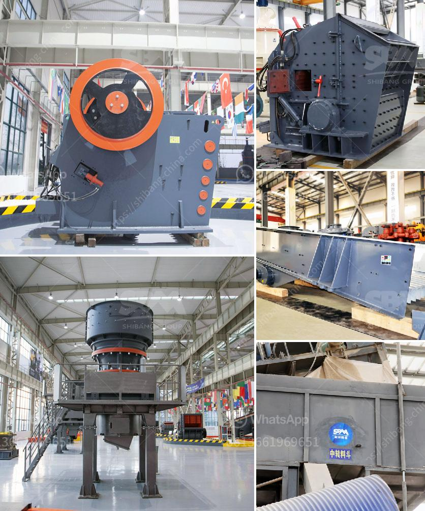

<h3>portable diamond washing plant</h3>
Diamonds have captivated human fascination for centuries, and their rarity and sparkle have made them one of the world's most valuable gemstones. However, extracting diamonds from the earth is a laborious process that requires a combination of sophisticated techniques and state-of-the-art equipment. The introduction of portable diamond washing plants has revolutionized the diamond mining industry, enabling efficient and cost-effective diamond extraction in remote locations.

A portable diamond washing plant is a compact, mobile unit that is specially designed to remove mud, clay, and other impurities from diamond-bearing ore. This innovative technology eliminates the need for expensive and time-consuming traditional washing plants, which are fixed installations requiring extensive infrastructure. With the portable diamond washing plant, diamond miners can now easily transport the entire washing plant to the mining site, reducing logistical challenges and operational costs.

The portable diamond washing plant consists of several modules that work seamlessly together to ensure the efficient recovery of diamonds. The first module is the feed hopper, where the diamond-bearing ore is loaded. The ore is then fed into a trommel, a rotating drum that screens out larger rocks and allows the smaller material, including diamonds, to pass through. The trommel is equipped with screens of different sizes to separate the ore into various fractions, optimizing diamond recovery.

Next, the ore passes through a scrubber, which uses highly pressurized water and mechanical action to break down clay and release diamonds trapped within it. The scrubber is equipped with strategically placed nozzles that ensure thorough cleaning of the ore. The washed material is then directed into a vibrating screen, which further classifies the ore based on size.

To recover the diamonds, the classified ore is fed into a dense media separation (DMS) module. The DMS module uses a suspension of ferrosilicon in water, which has a specific gravity that allows diamonds to sink, while lighter materials float. Within the DMS module, a series of magnetic and non-magnetic dense media cyclone stages further separate the ore, concentrating the diamonds for final extraction.

Once the ore has been efficiently separated, it undergoes final diamond recovery using a vibrating pan concentrator or a jigger system. These devices exploit the difference in specific gravity between diamonds and other minerals, allowing diamonds to settle in trays or compartments for easy collection.

The portability of the diamond washing plant makes it highly versatile in various diamond mining scenarios. Its compact size allows it to operate in remote locations with limited access to water and electricity sources, making it an ideal solution for artisanal or small-scale diamond mining operations. Its mobility also means that it can be easily moved to different mining areas within a concession, maximizing diamond extraction and profitability.

In conclusion, the introduction of portable diamond washing plants has brought about a significant shift in the way diamond extraction is conducted. By making the entire washing plant mobile, diamond miners can now overcome logistical challenges and operate in remote locations with ease. This technology not only enhances efficiency but also allows for cost-effective diamond extraction, ensuring the sustainable supply of these valuable gemstones for years to come.
<h3>Contact us</h3><ul><li><strong>Whatsapp:&nbsp;<a href="https://wa.me/8613661969651">+8613661969651</a></strong></li><li><a href="https://swt.shibang-china.com/?git&amp;zhl&amp;portable diamond washing plant"><strong>Online Service(chat now)</strong></a></li></ul><h3>Related</h3><ul><li><a href='ball mill for powder.md'>ball mill for powder</a></li><li><a href='crawler type mobile crushers.md'>crawler type mobile crushers</a></li><li><a href='ultrafine grinding mill.md'>ultrafine grinding mill</a></li><li><a href='stone crusher machine price in philippines.md'>stone crusher machine price in philippines</a></li><li><a href='crusher machine manufacturers.md'>crusher machine manufacturers</a></li></ul>