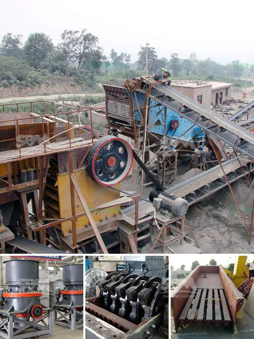

<h3>portable home gold processing machine</h3>
Gold mining has been a fundamental part of human history for centuries. From the legendary gold rushes that led to the settlement of entire regions to the modern-day mining operations that contribute to global economic development, gold has always held a special allure. However, traditional gold mining methods can be costly, time-consuming, and require significant investment in machinery. This is where the portable home gold processing machine comes in, revolutionizing the industry and making gold mining more accessible to individuals and small-scale operations.

The portable home gold processing machine is a compact, efficient, and cost-effective solution for processing gold ore. It eliminates the need for traditional gold mining methods that often involve large machinery, extensive infrastructure, and significant capital investment. Instead, this portable machine brings the processing plant directly to the site, reducing transportation costs and allowing for mining in remote locations.

One of the key advantages of the portable home gold processing machine is its versatility. It can process a wide range of gold ore types, including free-milling gold, sulfide-associated gold, and refractory gold. This means that individuals and small-scale miners can easily adapt to different ore deposits and maximize their gold recovery.

The machine operates on a simple principle: crushing the ore into a fine powder and then using various techniques to separate the gold from the other minerals present. It employs a combination of gravity separation, flotation, and cyanidation techniques, all of which have been extensively tested and optimized for efficiency. The entire process is automated and requires minimal human intervention, making it user-friendly for individuals with limited mining experience.

One of the most significant advantages of the portable home gold processing machine is its environmental footprint. Traditional mining methods often involve the extensive use of hazardous chemicals, such as mercury and cyanide, which pose serious threats to ecosystems and human health. In contrast, this innovative portable machine uses environmentally friendly processes and employs state-of-the-art technology to minimize any negative impact on the environment.

Moreover, the portable home gold processing machine can change the dynamics of gold mining in developing countries. Often, these countries are rich in gold deposits but lack the necessary infrastructure and resources to exploit them fully. With this portable machine, individuals and small-scale miners can tap into their local gold resources, creating economic opportunities and improving the livelihoods of local communities.

In conclusion, the portable home gold processing machine represents a game-changer in the gold mining industry. By bringing the processing plant directly to the site and eliminating the need for extensive infrastructure and capital investment, it makes gold mining more accessible to individuals and small-scale operations. Its versatility, user-friendly operation, and minimal environmental footprint make it a valuable tool for maximizing gold recovery. Furthermore, it has the potential to empower developing countries by allowing them to tap into their gold resources and stimulate local economies. As technology continues to advance, the portable home gold processing machine opens up new possibilities in the world of gold mining, making it a truly exciting development for the industry.
<h3>Contact us</h3><ul><li><strong>Whatsapp:&nbsp;<a href="https://wa.me/8613661969651">+8613661969651</a></strong></li><li><a href="https://swt.shibang-china.com/?git&amp;zhl&amp;portable home gold processing machine"><strong>Online Service(chat now)</strong></a></li></ul><h3>Related</h3><ul><li><a href='discovery of copper and cobalt in zambia.md'>discovery of copper and cobalt in zambia</a></li><li><a href='ball mills for cement grinding.md'>ball mills for cement grinding</a></li><li><a href='stoner cusher price in kenya.md'>stoner cusher price in kenya</a></li><li><a href='dolomite roller mill.md'>dolomite roller mill</a></li><li><a href='hammer mill sale south africa.md'>hammer mill sale south africa</a></li></ul>