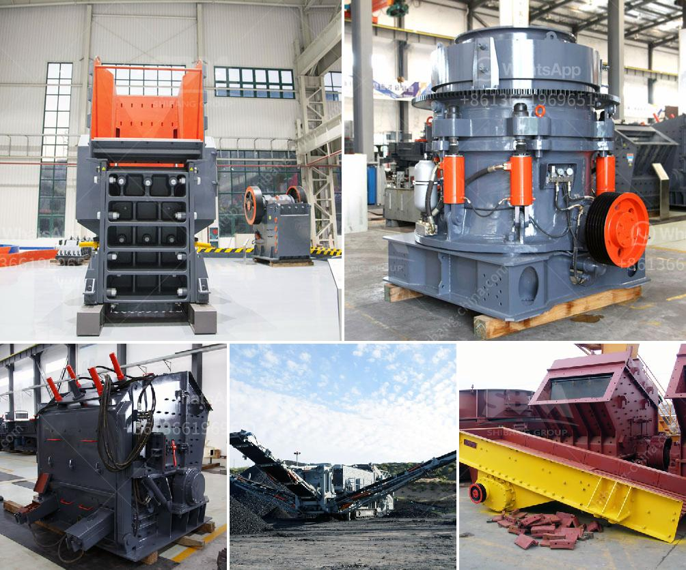

<h3>portable stone crusher four screens with cone</h3>
Portable stone crusher with four screens and cone crushing technology is designed for high mobility and efficiency in quarrying, mining, construction, and demolition debris recycling applications. The machine is equipped with a powerful and fuel-efficient engine that delivers reliable performance even in the most demanding conditions.

The four screens of the portable stone crusher allow for versatile screening options, enabling the user to obtain different sizes of finished products. This feature is particularly beneficial when multiple grades of aggregates are needed for various construction purposes. Whether it is constructing roads, building foundations, or producing concrete, the flexibility of the four screens ensures that the desired specifications can be easily achieved.

The cone crusher, equipped with advanced crushing technology, further enhances the efficiency of the portable stone crusher. It utilizes a hydraulic system to adjust the crusher setting, providing excellent control over product size and shape. This enables the user to produce high-quality aggregates of consistent gradation, which is crucial in various construction applications.

The portability of the stone crusher with four screens and cone allows for easy transportation between job sites. Its compact size and integrated hydraulic legs enable quick setup and dismantling, saving valuable time and effort. Additionally, the machine is equipped with a wireless remote control, enabling the operator to easily maneuver and operate the machine from a safe distance.

The portable stone crusher with four screens and cone offers numerous advantages for operators in the construction and mining industries. Its high mobility, efficiency, and versatility make it an ideal choice for various applications, including quarrying, mining, construction, and demolition debris recycling. With its powerful engine and advanced crushing technology, this machine provides reliable performance and delivers high-quality aggregates in a cost-effective manner.

In conclusion, the portable stone crusher with four screens and cone is a modern solution for efficient and mobile crushing operations. Its design incorporates the latest technology, ensuring high productivity and versatility. With its portability and ease of operation, it is a valuable asset for construction and mining professionals.
<h3>Contact us</h3><ul><li><strong>Whatsapp:&nbsp;<a href="https://wa.me/8613661969651">+8613661969651</a></strong></li><li><a href="https://swt.shibang-china.com/?git&amp;zhl&amp;portable stone crusher four screens with cone"><strong>Online Service(chat now)</strong></a></li></ul><h3>Related</h3><ul><li><a href='copper recycling process.md'>copper recycling process</a></li><li><a href='continuous ball mill for sale in malaysia.md'>continuous ball mill for sale in malaysia</a></li><li><a href='sand crusher machine price at india.md'>sand crusher machine price at india</a></li><li><a href='crusher machine factory in gujranwala pakistan.md'>crusher machine factory in gujranwala pakistan</a></li><li><a href='what is the meaning of 100tph in crusher crusher.md'>what is the meaning of 100tph in crusher crusher</a></li></ul>