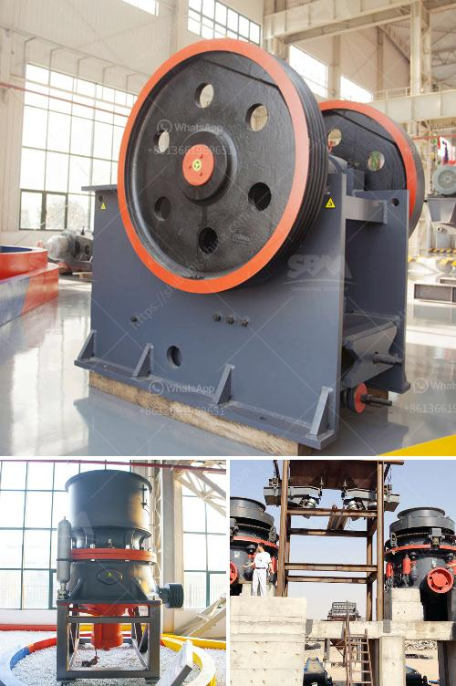

<h3>portable stone crushers uganda for sale</h3>
Portable stone crushers are a great addition to any construction site because they can be utilized for various rock crushing applications. Users can employ them on smaller construction projects as well as in more demanding situations such as blasting rock, and even quarrying. They are ideal for on-site crushing operations and are known for their compactness, mobility, and high efficiency.

One country that is benefiting immensely from the portable stone crushing industry is Uganda. Since old buildings and structures are being demolished in favor of new construction, the demand for stone cannot be underestimated. Uganda has limited natural sandstone deposits, specifically in the districts of Kawempe and Kyadondo, but these are consumed by large construction companies.

Portable stone crushers, therefore, play a crucial role in generating revenue and reducing spending on transport since they eliminate the need for costly transportation of raw materials to and from the construction site. Portable stone crushers are also capable of recycling concrete and asphalt and are ideal for use in urban areas where space constraints may hinder the construction process.

Uganda has a surplus of soft rock deposits as opposed to hard rock deposits. This makes portable stone crushers capable of crushing diverse materials such as limestone, concrete, asphalt, and other mineral ores. The versatility of the machine ensures that it performs equally well in both hard and soft rock applications.

The mobile stone crushing plant has a wide range of applications. It consists of crushing and screening machines, which can be easily moved from one location to another. Designed to reduce the size of large rocks, ores, and other minerals, portable crushers are primarily used in the construction and mining industries.

The availability of portable stone crushers for sale in Uganda is a huge advantage for local construction companies and individuals. Rapid urbanization is increasing the demand for stone materials, so further investment in portable stone crushers should be a priority for any company that wants to capitalize on this opportunity. The flexibility of these crushers reduces the need for transporting raw materials, hence significantly cutting transportation costs.

Furthermore, portable stone crushers also help in recycling concrete and asphalt waste, which greatly contributes to environmental sustainability. By crushing and recycling these materials, companies can reuse them for future construction projects while reducing the amount of waste that ends up in landfills.

In conclusion, portable stone crushers in Uganda are an efficient, affordable, and reliable solution for various construction activities that is becoming increasingly popular in the country. The demand for stone aggregate is constantly rising, which requires investing in portable crushers to enrich your business endeavors significantly. Moreover, the recycling capabilities of portable stone crushers contribute to environmental preservation and reduce waste accumulation. With their compactness, high efficiency, and mobility, these crushers offer flexibility and convenience on construction sites, making them an excellent addition to any project.
<h3>Contact us</h3><ul><li><strong>Whatsapp:&nbsp;<a href="https://wa.me/8613661969651">+8613661969651</a></strong></li><li><a href="https://swt.shibang-china.com/?git&amp;zhl&amp;portable stone crushers uganda for sale"><strong>Online Service(chat now)</strong></a></li></ul><h3>Related</h3><ul><li><a href='small bleaching powder manufacturing plant project report.md'>small bleaching powder manufacturing plant project report</a></li><li><a href='copper refinery machine south africa.md'>copper refinery machine south africa</a></li><li><a href='howhow to set up a stone crushing business.md'>howhow to set up a stone crushing business</a></li><li><a href='second hand sand mill in holland.md'>second hand sand mill in holland</a></li><li><a href='sand washing machines for crusher nepal.md'>sand washing machines for crusher nepal</a></li></ul>