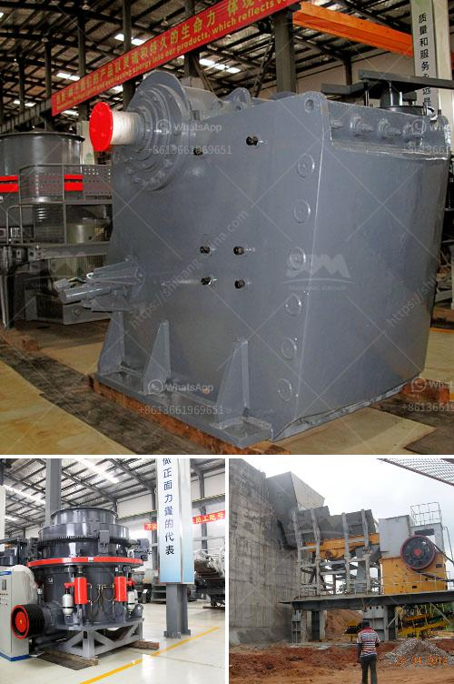

<h3>portland cement processing units</h3>
Portland cement processing units play a vital role in the construction industry by producing the most widely used building material, known as Portland cement. These units are responsible for transforming raw materials into cement powder through a series of rigorous processes. With an increasing global demand for cement, the importance of efficient and sustainable processing units cannot be overstated.

The production of Portland cement involves several key steps. Firstly, limestone and clay or shale are extracted from quarries and transported to the processing units. These raw materials are crushed into small pieces and then ground into a fine powder. The powder is then mixed with other additives such as gypsum, which regulates the setting time of the cement, and limestone, which enhances its strength.

After the mixing process, the powder is fed into a kiln, which is heated to high temperatures of about 1450°C. This calcination process causes chemical reactions that convert the raw materials into clinker, a nodular substance. The clinker is then ground with a small amount of gypsum to produce the final product, Portland cement.

The processing units are equipped with advanced technologies to ensure precise control over the production process. Automation and computerized systems monitor the quality and consistency of the cement, ensuring compliance with desired standards. Furthermore, the units prioritize energy efficiency and environmental sustainability by utilizing alternative fuels, such as biomass or waste materials, to reduce carbon emissions.

The production capacity of these cement processing units varies, with some units capable of producing several million tons of cement per year. The size and capacity of the units depend on the demand for cement in their respective regions. Multiple units may be located in strategic locations to cater to local construction needs and reduce transportation costs.

In conclusion, Portland cement processing units are critical in meeting the global demand for cement. These units employ advanced technologies, adhere to strict quality control measures, and work towards environmentally friendly practices. With their efficient production processes, these units contribute to the growth and development of the construction industry worldwide.
<h3>Contact us</h3><ul><li><strong>Whatsapp:&nbsp;<a href="https://wa.me/8613661969651">+8613661969651</a></strong></li><li><a href="https://swt.shibang-china.com/?git&amp;zhl&amp;portland cement processing units"><strong>Online Service(chat now)</strong></a></li></ul><h3>Related</h3><ul><li><a href='dealers and manufacturers crusher in europe.md'>dealers and manufacturers crusher in europe</a></li><li><a href='used track mounted stone crusher.md'>used track mounted stone crusher</a></li><li><a href='used metal crushers japan.md'>used metal crushers japan</a></li><li><a href='trackmounted crushing.md'>track-mounted crushing</a></li><li><a href='dolomite crushing plant in bharuch.md'>dolomite crushing plant in bharuch</a></li></ul>