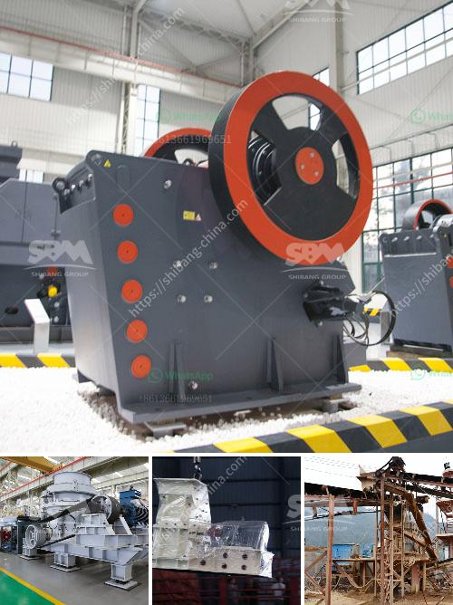

<h3>powder grinding mill machine equipment</h3>
Powder grinding mill machine equipment is a vital part of many industrial processes today. This type of machinery is employed for grinding various types of materials into fine powders, such as minerals, cement, ceramics, silicates, and many more. The powder grinding mill machine equipment plays an essential role in industries such as metallurgy, mining, chemical engineering, and construction.

One of the significant advantages of using a powder grinding mill machine equipment is its ability to produce a finely ground product. This machinery enables the production of powders with a particle size ranging from a few microns to several millimeters, depending on the desired final product specifications. The versatility of the powder grinding mill machine equipment makes it suitable for grinding a wide range of materials, including hard materials like minerals and soft materials like organic chemicals.

The design of the powder grinding mill machine equipment varies depending on the application and the required grinding capacity. There are numerous types of powder grinding mill machine equipment available on the market, such as ball mills, vertical roller mills, hammer mills, and more. Each mill type has its advantages and disadvantages, and the selection depends on factors such as the material to be ground, the desired particle size, and the required production capacity.

Ball mills are one of the most commonly used powder grinding mill machine equipment. They utilize a rotating drum filled with grinding media, such as balls, to crush and grind the materials. The grinding action of the balls inside the mill produces a fine powder, which is then collected in a cyclone separator or a bag filter. Ball mills are suitable for grinding both dry and wet materials.

Vertical roller mills, on the other hand, are another popular type of powder grinding mill machine equipment. These mills consist of a large vertical grinding chamber filled with grinding rollers. The materials are fed into the mill through a hopper, and the grinding rollers crush and grind the materials against a stationary grinding plate. The ground materials are collected in a separator, and the fine powder is discharged through an outlet. Vertical roller mills provide excellent grinding efficiency and are commonly used in the cement industry.

Hammer mills are unique powder grinding mill machine equipment that utilize rotating hammers mounted on a rotor to crush and grind materials. The materials are fed into a grinding chamber, and the rotating hammers impact the materials with high speed, causing them to break into smaller pieces. The crushed materials are further ground by centrifugal forces, and the fine powder is discharged through a screen. Hammer mills are suitable for grinding a wide range of materials, including grains, wood, and ores.

In conclusion, powder grinding mill machine equipment is an indispensable tool in many industries. Its ability to grind various materials into fine powders makes it crucial for the production of a wide range of products. The selection of the appropriate type of mill depends on factors such as the material to be ground, the desired particle size, and the required production capacity. Whether it is a ball mill, vertical roller mill, or hammer mill, there is a powder grinding mill machine equipment suitable for every grinding application.
<h3>Contact us</h3><ul><li><strong>Whatsapp:&nbsp;<a href="https://wa.me/8613661969651">+8613661969651</a></strong></li><li><a href="https://swt.shibang-china.com/?git&amp;zhl&amp;powder grinding mill machine equipment"><strong>Online Service(chat now)</strong></a></li></ul><h3>Related</h3><ul><li><a href='rock and gravel crushers used.md'>rock and gravel crushers used</a></li><li><a href='crusher run for sale in sabah.md'>crusher run for sale in sabah</a></li><li><a href='germany stone crusher machine factories.md'>germany stone crusher machine factories</a></li><li><a href='pulverizing machines in south africa.md'>pulverizing machines in south africa</a></li><li><a href='track crushing plant.md'>track crushing plant</a></li></ul>