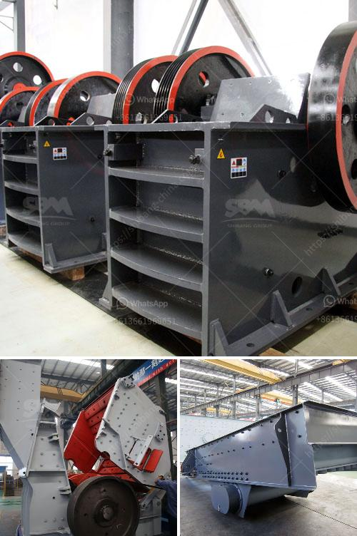

<h3>price for 100 tph impact crusher</h3>
The price of a 100 tph impact crusher can vary significantly depending on the manufacturer, model, and supplier. With several manufacturers and brands available in the market, it may be challenging to find the right crusher for your needs. Here, we will explore the factors influencing the price of a 100 tph impact crusher.

Firstly, the brand and reputation of the manufacturer can greatly impact the price. Well-established and reputable manufacturers often charge higher prices for their products due to the quality, durability, and reliability they offer. Choosing a renowned brand may be a wise investment in the long run, as it ensures a higher chance of receiving a superior product.

Secondly, the model and specifications of the crusher play a crucial role in determining its price. Different models of 100 tph impact crushers may have varying features, capacities, and power requirements, leading to price differences. Assessing your specific requirements and matching them with the suitable model can help you narrow down your options and find a crusher within your budget.

Another factor affecting the price is the supplier or distributor. Different suppliers may have varying pricing strategies and overhead costs. It is recommended to obtain quotes from multiple suppliers to compare prices and ensure that you are getting the best deal.

Additionally, the location and transportation costs can impact the final price of the crusher. If the crusher needs to be transported a long distance or across borders, the logistics and shipping expenses will be added to the overall cost. Thus, it is essential to consider these factors before finalizing your purchase decision.

Lastly, market demand and competition can also affect the pricing of 100 tph impact crushers. During periods of high demand or when there is limited competition, the prices may increase. Conversely, during periods of low demand or when there is fierce competition, the prices may become more competitive.

In conclusion, the price for a 100 tph impact crusher depends on various factors such as the brand, model, specifications, supplier, location, and market conditions. Conducting thorough research, comparing quotes, and considering your specific requirements can help you find a crusher that meets your needs and fits your budget.
<h3>Contact us</h3><ul><li><strong>Whatsapp:&nbsp;<a href="https://wa.me/8613661969651">+8613661969651</a></strong></li><li><a href="https://swt.shibang-china.com/?git&amp;zhl&amp;price for 100 tph impact crusher"><strong>Online Service(chat now)</strong></a></li></ul><h3>Related</h3><ul><li><a href='dolomite stone crusher manufacturers.md'>dolomite stone crusher manufacturers</a></li><li><a href='lister petter maize hammer mills.md'>lister petter maize hammer mills</a></li><li><a href='cone crushers for sale south africa.md'>cone crushers for sale south africa</a></li><li><a href='medium ballast making machine.md'>medium ballast making machine</a></li><li><a href='process of cement production.md'>process of cement production</a></li></ul>