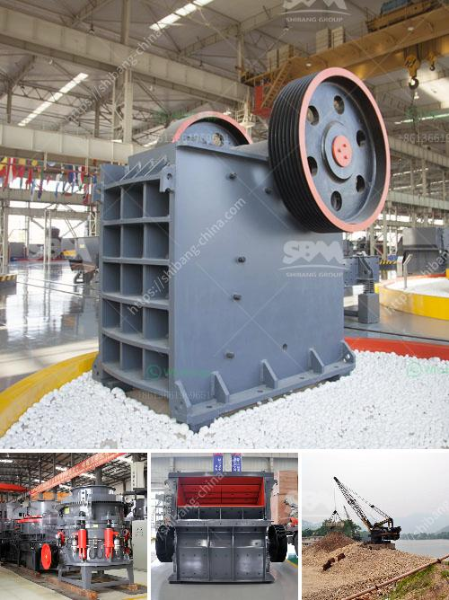

<h3>price for china crusher</h3>
In recent years, China has emerged as a global manufacturing hub, producing a wide range of products at relatively competitive prices. One such industry that has witnessed significant growth and development is the crusher manufacturing sector. Crushers are commonly used in various industries for crushing different types of materials. Understanding the price dynamics of crushers in China is crucial for those looking to enter or expand their operations in this sector.

1. Quality and Technology: With China's crusher market becoming increasingly competitive, manufacturers strive to improve product quality and integrate advanced technology. Crushers with superior quality and cutting-edge features tend to be priced higher due to higher manufacturing costs.

2. Brand Reputation: Well-established crusher brands create a sense of trust and reliability amongst consumers. These brands often charge a premium for their products due to their reputation for durability, performance, and after-sales service.

3. Production Costs: The cost of raw materials, labor, energy, and overhead expenses directly impacts the pricing of crushers in China. For example, fluctuations in steel prices can significantly impact the overall cost of manufacturing crushing equipment.

4. Market Demand and Competition: The demand for crushers in China is vast and diverse, catering to industries like mining, construction, and recycling. The presence of numerous manufacturers creates intense competition, which can potentially drive down prices.

5. Size and Model: Crushers come in different sizes and models, catering to various needs and output capacities. Typically, larger and more advanced models are pricier due to their enhanced capabilities and production capacities.

The pricing of crushers in China is a result of multiple factors such as quality, technology, brand reputation, production costs, market demand, competition, and size or model. Investors and buyers looking to purchase crushers should conduct thorough research, compare prices, and evaluate the overall cost-effectiveness. It is also advisable to consider long-term factors like after-sales service, spare parts availability, and warranty terms to ensure a satisfactory purchase.

In conclusion, the competitive crusher market in China offers both challenges and opportunities for buyers. By understanding the pricing dynamics and evaluating their specific requirements, investors and buyers can make informed decisions when it comes to purchasing crushers in China.
<h3>Contact us</h3><ul><li><strong>Whatsapp:&nbsp;<a href="https://wa.me/8613661969651">+8613661969651</a></strong></li><li><a href="https://swt.shibang-china.com/?git&amp;zhl&amp;price for china crusher"><strong>Online Service(chat now)</strong></a></li></ul><h3>Related</h3><ul><li><a href='turkey crusher company.md'>turkey crusher company</a></li><li><a href='rock crushing plant 100tph.md'>rock crushing plant 100tph</a></li><li><a href='250 400 pe jaw crusher price list.md'>250 400 pe jaw crusher price list</a></li><li><a href='desain hammer mill dengan pelat rotor pdf.md'>desain hammer mill dengan pelat rotor pdf</a></li><li><a href='portable stone crusher four screens with cone.md'>portable stone crusher four screens with cone</a></li></ul>