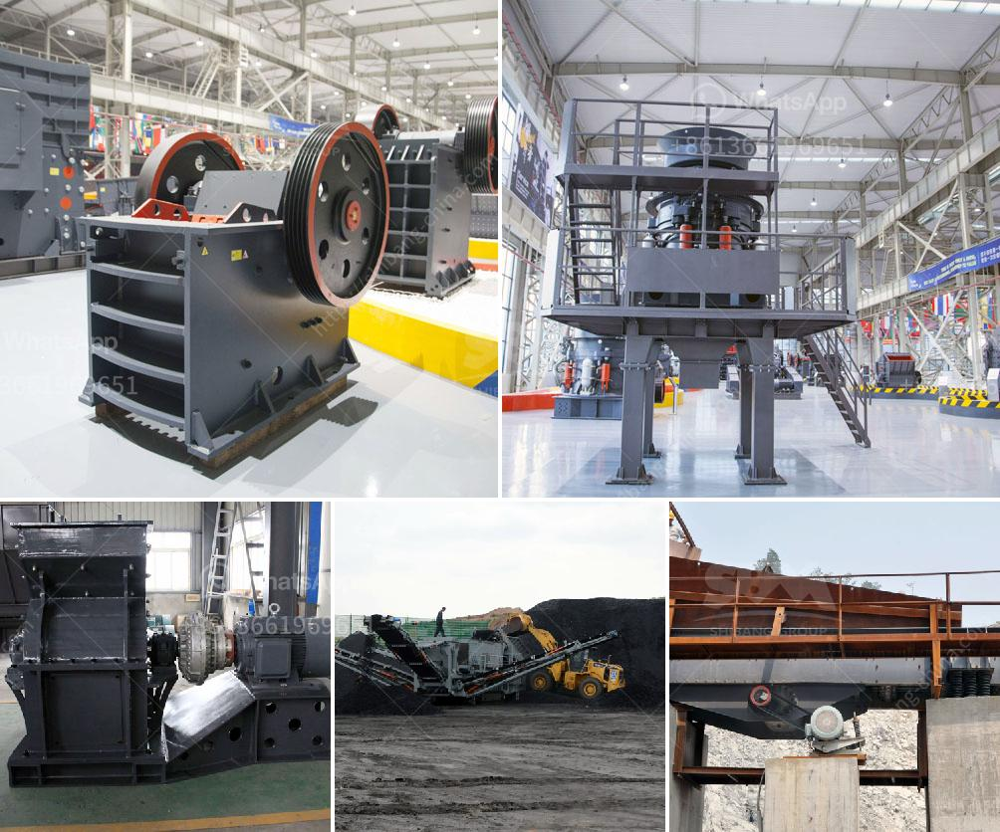

<h3>price for sand machine</h3>
When it comes to purchasing a sand machine, price is a significant factor to consider. The price of the machine can vary depending on different factors, such as the brand, model, features, and overall quality. However, it is crucial to strike a balance between affordability and quality. Let's delve into the importance of the price factor when selecting a sand machine.

Firstly, price directly affects your budget. Setting a budget before making any purchase is essential, as it helps you narrow down your options. A sand machine's price range can vary significantly, so having a predetermined budget will allow you to focus on machines that fall within your financial means.

Secondly, price can be an indication of quality. While it is not always the case, cheap sand machines tend to lack the durability and reliability needed for consistent performance. Investing in a higher-priced machine might be a better long-term decision as it is likely to offer better construction, higher output, and enhanced features.

Furthermore, the price of the sand machine also determines its functionality and efficiency. Higher-priced machines often come with advanced features and technology that can help improve your productivity and the quality of the sand output. These machines might have better filtration systems, adjustable speed controls, and improved dust collection mechanisms, ensuring you can produce high-quality sand for your specific needs.

On the other hand, if you are on a tight budget, there are still affordable sand machines available. It is essential to research and compare the specifications and features of different machines within your budget range. However, remember to prioritize quality and durability over just the lowest price.

In conclusion, price plays a significant role when selecting a sand machine for your sand production needs. It is crucial to strike a balance between your budget and the quality, durability, and functionality of the machine. Investing in a high-quality sand machine can ensure long-term performance and efficiency, ultimately leading to increased productivity and profitability for your business.
<h3>Contact us</h3><ul><li><strong>Whatsapp:&nbsp;<a href="https://wa.me/8613661969651">+8613661969651</a></strong></li><li><a href="https://swt.shibang-china.com/?git&amp;zhl&amp;price for sand machine"><strong>Online Service(chat now)</strong></a></li></ul><h3>Related</h3><ul><li><a href='50tpd slag cement grinding unit cost.md'>50tpd slag cement grinding unit cost</a></li><li><a href='gypsum board plant cost.md'>gypsum board plant cost</a></li><li><a href='hammer mills for sale in south africa.md'>hammer mills for sale in south africa</a></li><li><a href='difference between vsi and sand making machine.md'>difference between vsi and sand making machine</a></li><li><a href='india gold processing plant apr.md'>india gold processing plant apr</a></li></ul>