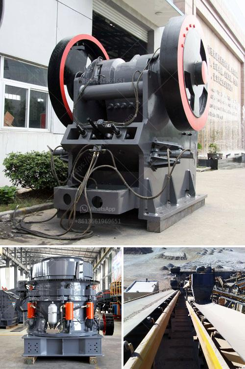

<h3>price jaw crusher pdf</h3>
The price of a jaw crusher is not fixed and the range of prices is large. The factors influencing the price include the brand, quality, specifications, after-sales service, etc. As a professional manufacturer of mining machinery, Zenith Mining Machinery takes the lead in the research and development of equipment. With the continuous improvement of technology and the updating of equipment, the performance of jaw crusher has been greatly improved. The innovation and improvement of jaw crusher not only attracts customers' attention, but also wins their trust.

Zenith Mining Machinery uses advanced manufacturing technology and selects high-quality materials to produce equipment, ensuring the performance and service life of the equipment. In addition, the after-sales service provided by Zenith is also excellent. Technical support, installation guidance, regular maintenance, and spare parts supply are all available to ensure the smooth operation of the equipment and maximize the benefits for customers.

Regarding the price of jaw crusher, it is affected by various factors. Firstly, different manufacturers have different production costs and brand influences, which may result in different prices. Secondly, the specifications of the equipment also affect the price. Different models have different processing capacities, motor powers, and sizes, which will lead to different prices. Lastly, the choice of configuration also affects the price. Equipment with different configurations may have different prices, and customers can choose according to their own needs and budget.

In conclusion, the price of jaw crusher is determined by multiple factors, such as brand, quality, specifications, and after-sales service. Customers should not only focus on the price, but also consider the overall cost performance, so as to select suitable equipment and gain more benefits. With continuous innovation and improvement, Zenith Mining Machinery provides customers with high-quality jaw crushers and excellent services, making it a trustworthy choice for customers.
<h3>Contact us</h3><ul><li><strong>Whatsapp:&nbsp;<a href="https://wa.me/8613661969651">+8613661969651</a></strong></li><li><a href="https://swt.shibang-china.com/?git&amp;zhl&amp;price jaw crusher pdf"><strong>Online Service(chat now)</strong></a></li></ul><h3>Related</h3><ul><li><a href='canadian gold mining equipment manufacturers.md'>canadian gold mining equipment manufacturers</a></li><li><a href='costs a stone crushing machine when a stone crusher.md'>costs a stone crushing machine when a stone crusher</a></li><li><a href='large scale gold mining equipment for sale.md'>large scale gold mining equipment for sale</a></li><li><a href='used mobile crushers for sale south africa.md'>used mobile crushers for sale south africa</a></li><li><a href='equipment used in small scale mining in ghana.md'>equipment used in small scale mining in ghana</a></li></ul>