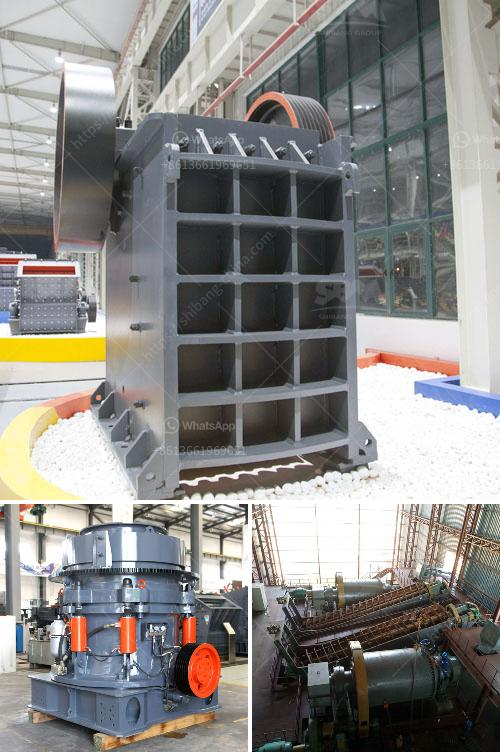

<h3>price limestone crusher for sale</h3>
Limestone is a sedimentary rock composed mainly of calcium carbonate (CaCO3), usually in the form of calcite or aragonite. It is a valuable resource that is widely used in construction, agriculture, and various industrial applications. As a result, limestone has a high demand in the market, and the price of limestone crusher for sale can vary depending on numerous factors.

1. The type of limestone crusher: Jaw crushers tend to be more affordable compared to impact crushers. This is because the jaw crusher requires less maintenance and is more suited for primary crushing purposes, while impact crushers are mainly used for secondary and tertiary crushing.

2. Production capacity: The higher the production capacity of the limestone crusher, the more expensive it can be. Crushers with higher capacities are designed to handle more limestone and deliver higher outputs, which can justify the higher price.

3. Brand reputation: Well-known brands often come with premium price tags. This is because established brands have a reputation to maintain and invest heavily in research and development to provide high-quality and durable crushers.

4. Market demand: If there is a high demand for limestone crushers in the market, the price is likely to be higher. Conversely, if the demand is low, the price may be more competitive as sellers would be looking to attract buyers with lower prices.

5. Additional features: Some limestone crushers come with additional features that enhance their performance or ease of use. These additional features, such as adjustable settings, automatic feeding systems, or remote control, can add to the overall cost of the crusher.

In conclusion, the price of limestone crusher for sale can vary depending on various factors, including the type of crusher, production capacity, brand reputation, market demand, and additional features. It is always advisable to research and compare prices from different sellers or manufacturers before making a purchase to ensure you get the best value for your investment.
<h3>Contact us</h3><ul><li><strong>Whatsapp:&nbsp;<a href="https://wa.me/8613661969651">+8613661969651</a></strong></li><li><a href="https://swt.shibang-china.com/?git&amp;zhl&amp;price limestone crusher for sale"><strong>Online Service(chat now)</strong></a></li></ul><h3>Related</h3><ul><li><a href='project report on mini kaolin mining crusher.md'>project report on mini kaolin mining crusher</a></li><li><a href='how to select machines for stone crushing plant.md'>how to select machines for stone crushing plant</a></li><li><a href='grinding mill machine gebraucht.md'>grinding mill machine gebraucht</a></li><li><a href='continuous ball mill for sale in malaysia.md'>continuous ball mill for sale in malaysia</a></li><li><a href='portable diamond washing plant.md'>portable diamond washing plant</a></li></ul>