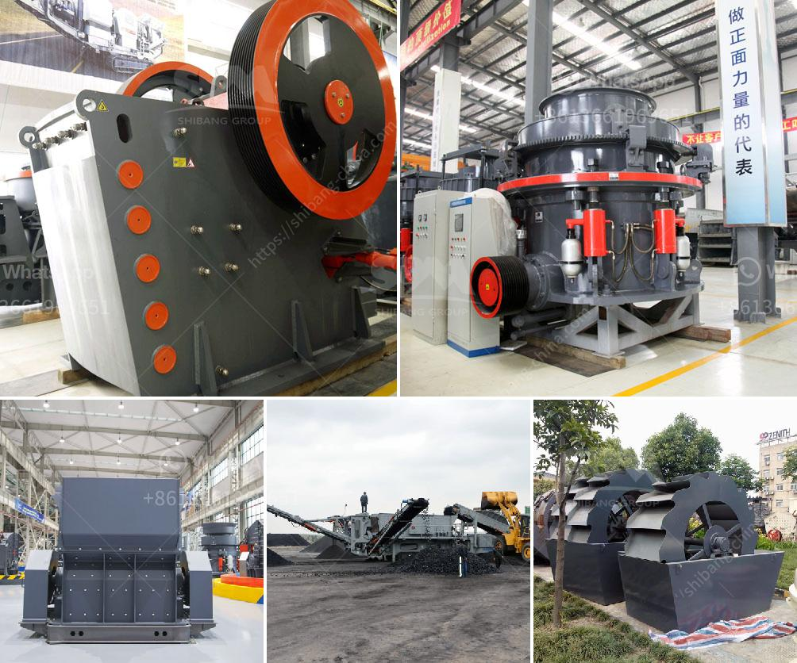

<h3>price list stone crusher machine guangzhou</h3>
Stone crusher machine is widely used in various materials processing of mining and construction industries, such as it is suit for crushing granite, marble, basalt, limestone, quartz, cobble, iron ore, copper ore, and some other mineral and rocks. Due to its wide applications, it is definitely a popular crusher in the market as well as an efficient stone crushing equipment.

As a direct manufacturer and dealer of mining equipment with 10 years of experience in this field, in addition to our professional technology support, HYB has become one of the leading suppliers in the crushing industry. This enables us to provide temporary crushing equipment, which includes complete set of stone crusher machines such as jaw crusher, impact crusher, cone crusher, sand making machine, sand washing machine, vibration feeder, vibrating screen, belt conveyor and other industry machinery.

With the professional technology and a full range of services, HYB is to provide the most effective crushing machines at a competitive price with high quality. For customers who want to buy a stone crusher machine, some factors need to be considered, such as production requirements, capital cost, ore characteristic etc.

To provide customers with the most suitable product design cost-effective price, HYB is always adhering to the principle of "best service, best quality, best price". We sincerely welcome you to visit our company and negotiate mutual business!

In order to offer the most suitable stone crusher machine products, we offer customers with 2D, 3D drawing software of their crushing machines. Our engineers can provide customers with a complete set of crushing and screening solutions, which is mainly composed of jaw crusher, cone crusher, impact crusher, vibrating feeder, vibrating screen, belt conveyor and dust removal equipment. These crushing and screening production lines also feature high performance, high reliability, reasonable design, simple operation and high cost performance.

As for the price of the stone crusher machine, different models have different prices. According to different requirementsof customers, different manufacturers provide different prices. The price of the stone crusher machine is high or low, mainly depends on the following factors: different manufacturers of stone crusher machine, equipment quality, stone crusher machine price in india, market competition.

Lastly, we hope that through the above article, we have understood more about the cost of stone crusher machine; the price list stone crusher machine guangzhou can help you better understand the machine and choose the right one for you; in addition, we also provide reasonable price and high-quality services to every customer. HYB is at your service.
<h3>Contact us</h3><ul><li><strong>Whatsapp:&nbsp;<a href="https://wa.me/8613661969651">+8613661969651</a></strong></li><li><a href="https://swt.shibang-china.com/?git&amp;zhl&amp;price list stone crusher machine guangzhou"><strong>Online Service(chat now)</strong></a></li></ul><h3>Related</h3><ul><li><a href='aggregate processing equipment.md'>aggregate processing equipment</a></li><li><a href='cost of complete stone crushing plant in ghana.md'>cost of complete stone crushing plant in ghana</a></li><li><a href='clinker grinding plant.md'>clinker grinding plant</a></li><li><a href='aggregates crushing flow chart process.md'>aggregates crushing flow chart process</a></li><li><a href='equipment for dimension stone production.md'>equipment for dimension stone production</a></li></ul>