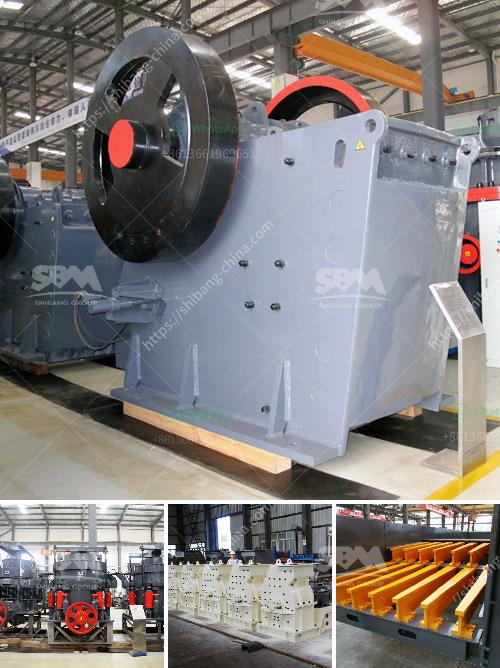

<h3>price of a stone crusher machine in zambia</h3>
The demand for stone crushing machinery is indeed experiencing a massive demand for rental units in Zambia. Stone crusher machine can be used to crush hard rocks, stones, minerals like hard limestone, basalt, cobble stone, river stone, slate, rubble stone, feldspar, iron ore, gold ore, granite, diamond, manganese ore, chromite ore, copper etc. into small particles, dusts and so on. SBM Machinery in Zambia offers a comprehensive range of stone crusher machine to complement the products sold by them.

The price of stone crusher machines in Zambia has always been the hot issue that the customers are concerned about. Comparing with the current stone crusher machine price in China, the price of Zambia stone crusher machines are much lower than those in the neighboring countries. The reason why stone crusher machine price in Zambia is popular lies in its incomparable characteristics. SBM stone crusher machine price in Zambia not only considers the investment cost of the user, but also can meet the crushing output requirement.

SBM stone crusher machine price in Zambia is commonly known as European jaw crusher, and is a new type of crusher developed by our company after the release of traditional jaw crusher. stone crusher machine price in Zambia is a perfect combination of modern science and technology and the production practice, which can better satisfy the automatic production demands of vast customers.

With an outstanding reduction in operation cost, it becomes the most ideal cone crusher machine for medium crushing and fine crushing projects. The working principle of stone crusher machine is very simple. The whole crushing process rely on the relative motion of the two jaw plates. One of the jaw plates stay still while the other move against it. And with the movement, the materials between the two plates would be crushed into small elements. While the plates move against each other, the materials would be crushed and while plates move away from each other, the broken materials which are smaller enough would drop through the discharging opening. And due to the simple structure, stone crusher machine price in Zambia is easy to maintain and repair.

SBM stone crusher machine price in Zambia can be widely used for crushing and screening in many areas such as road construction, building, metallurgical and energy industries, etc. Jaw crusher is the core minerals crushing equipment in the mobile jaw crusher plant, it is applicable for crushing hard rock like granite, quartzite and Silicon carbide and so on. And jaw crusher can be used in for stone crushing and screening project, grinding mill for quarrying, mining industry in India, China, Nigeria, Zambia, Ghana, Zimbabwe, Sudan.

In summary, SBM has developed many types of stone crusher machine in Zambia which are sold on the market. From the feedback of the customers, we can find that the price of stone crusher machine in Zambia is quite reasonable considering the quality and the production capacity. The suppliers are also providing a wide range of options for customers to choose from. So if you are looking for stone crusher machine in Zambia, SBM is your best choice.
<h3>Contact us</h3><ul><li><strong>Whatsapp:&nbsp;<a href="https://wa.me/8613661969651">+8613661969651</a></strong></li><li><a href="https://swt.shibang-china.com/?git&amp;zhl&amp;price of a stone crusher machine in zambia"><strong>Online Service(chat now)</strong></a></li></ul><h3>Related</h3><ul><li><a href='magnesite ore mining process.md'>magnesite ore mining process</a></li><li><a href='harga dan tipe stone crusher indonesia.md'>harga dan tipe stone crusher indonesia</a></li><li><a href='mineral processing equipment.md'>mineral processing equipment</a></li><li><a href='quartz stone manufacturing plant.md'>quartz stone manufacturing plant</a></li><li><a href='stone crusher plant project report.md'>stone crusher plant project report</a></li></ul>