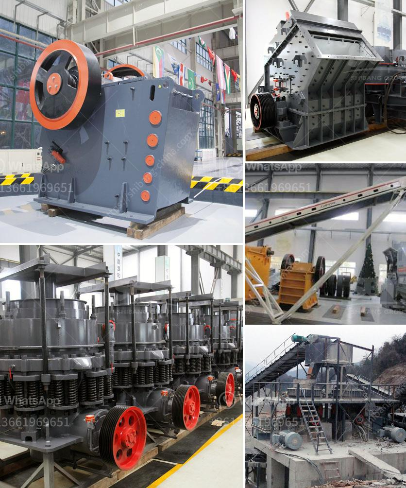

<h3>price of cocoa processing equipment</h3>
The price of cocoa processing equipment is an important factor to consider for individuals or businesses that are involved in the cocoa industry. Cocoa processing equipment refers to the machinery used for the industrial processing of cocoa beans into cocoa powder, cocoa butter, and other cocoa-based products. The investment in this equipment can be significant, but it is essential for enhancing cocoa production efficiency and ensuring the quality of the final product.

The price of cocoa processing equipment can vary depending on various factors such as the capacity, design, and features of the machinery. Generally, smaller capacity equipment, which may be suitable for small-scale or artisanal operations, tends to have a lower price range. On the other hand, equipment with higher capacity and advanced technology, designed for larger-scale industrial production, tends to have a higher price range.

In general, the price of cocoa processing equipment can range from a few thousand dollars to several hundred thousand dollars. Equipment with a capacity of processing 100 to 300 kilograms of cocoa beans per hour typically falls within this price range. However, it is important to note that these price ranges are estimates, and the final cost can vary depending on the manufacturer, location, and other factors such as installation and warranty.

When investing in cocoa processing equipment, it is crucial to consider factors beyond just the price. It is advisable to evaluate the quality, reputation, and reliability of the manufacturer, as well as after-sales services, warranties, and technical support offered. Consulting with industry experts or cocoa processing professionals can provide valuable insights and recommendations to make an informed decision.

In conclusion, the price of cocoa processing equipment can vary depending on several factors. It plays a significant role in determining the overall investment required for cocoa processing operations. While it is important to consider the price, other factors such as quality, reliability, and after-sales services should also be considered to ensure the cost-effectiveness and long-term success of the cocoa processing venture.
<h3>Contact us</h3><ul><li><strong>Whatsapp:&nbsp;<a href="https://wa.me/8613661969651">+8613661969651</a></strong></li><li><a href="https://swt.shibang-china.com/?git&amp;zhl&amp;price of cocoa processing equipment"><strong>Online Service(chat now)</strong></a></li></ul><h3>Related</h3><ul><li><a href='rotary screen for coal making process.md'>rotary screen for coal making process</a></li><li><a href='slag crusher plant.md'>slag crusher plant</a></li><li><a href='ton per hour gold wash plant.md'>ton per hour gold wash plant</a></li><li><a href='cost of 200 tpd clinker grinding plant.md'>cost of 200 tpd clinker grinding plant</a></li><li><a href='ball mills for cement grinding.md'>ball mills for cement grinding</a></li></ul>