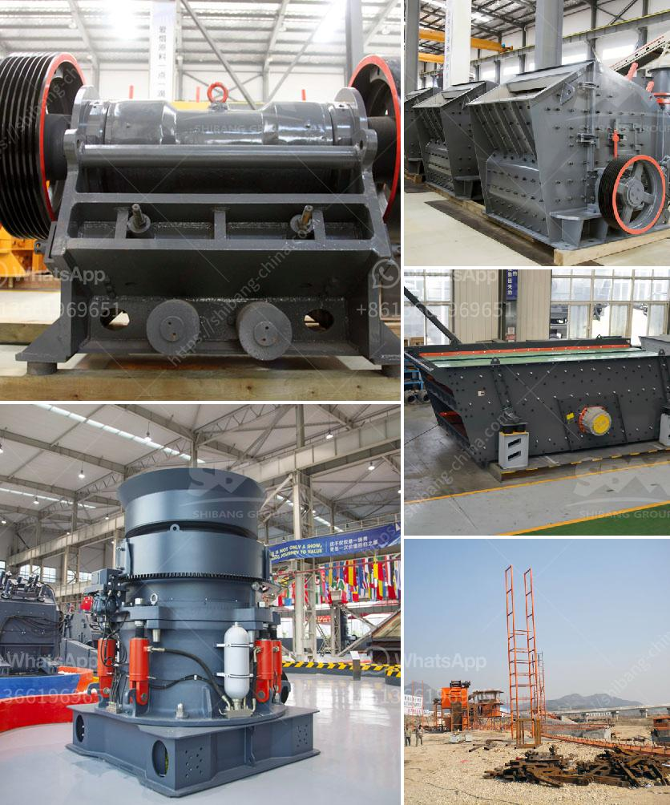

<h3>price of dolomite grinding machine stone crusher machine</h3>
The price of dolomite grinding machine stone crusher machine is a crucial factor in the purchasing process of the machine. When you purchase dolomite grinding machine, stone crusher machine, it is important to do a proper market research. You should also take the price into consideration. What factors influence the price of dolomite grinding machine, stone crusher machine?

Firstly, the brand. Different brands of dolomite grinding machines, stone crusher machines have different prices. The brand is an important factor influencing the price of the machine. A well-known brand is likely to have a higher price compared to a lesser-known brand. However, a well-known brand may also provide better quality and after-sales service, making it a worthwhile investment.

Secondly, the capacity of the machine. The capacity of a dolomite grinding machine stone crusher machine determines its price to a great extent. If the machine has a high capacity, it is likely to have a higher price. Higher capacity machines can grind more dolomite stones, thus increasing efficiency and productivity. However, if you have a lower demand or a smaller budget, you can opt for a lower capacity machine.

Thirdly, the features and specifications of the machine. Different features and specifications can also affect the price of a dolomite grinding machine, stone crusher machine. For example, if the machine has advanced technology, multiple functions, or additional accessories, it is likely to have a higher price compared to a basic machine. The more features and specifications a machine has, the higher the price will be.

Lastly, the level of automation. A fully automated dolomite grinding machine stone crusher machine is likely to have a higher price compared to a semi-automated or manual machine. Automated machines offer convenience, precision, and higher productivity, which may justify the higher price.

In conclusion, when purchasing a dolomite grinding machine, stone crusher machine, it is important to consider factors such as the brand, capacity, features and specifications, and level of automation. By doing thorough research and comparing prices, you can find a machine that best suits your needs and budget.
<h3>Contact us</h3><ul><li><strong>Whatsapp:&nbsp;<a href="https://wa.me/8613661969651">+8613661969651</a></strong></li><li><a href="https://swt.shibang-china.com/?git&amp;zhl&amp;price of dolomite grinding machine stone crusher machine"><strong>Online Service(chat now)</strong></a></li></ul><h3>Related</h3><ul><li><a href='gold wash plant equipment in ghana.md'>gold wash plant equipment in ghana</a></li><li><a href='hammer mill and impactors unit.md'>hammer mill and impactors unit</a></li><li><a href='granite milling unit.md'>granite milling unit</a></li><li><a href='grinding mill for quartz in india.md'>grinding mill for quartz in india</a></li><li><a href='conveyor belt manufacturer in china.md'>conveyor belt manufacturer in china</a></li></ul>