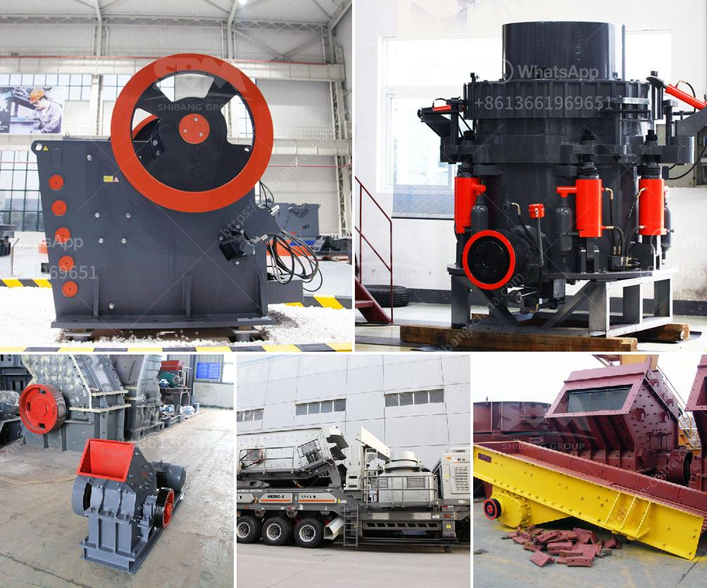

<h3>price of granite crusher tons per hour</h3>
Granite is a common type of igneous rock that can be found in various parts of the world. It is known for its durability, strength, and aesthetic appeal, making it a popular choice for construction projects like countertops, flooring, and driveways. To obtain crushed granite, the rock is first blasted from its natural state in quarries and then processed into smaller sizes using crushing equipment, such as a granite crusher.

When it comes to purchasing a granite crusher, tons per hour is an important factor to consider. This metric determines the capacity of the crusher and how much rock it can process in a given timeframe. The price of a granite crusher is often influenced by its production capacity, measured in tons per hour. As a general rule, the higher the capacity, the higher the price.

For example, a granite crusher that can crush 200 tons per hour will be more expensive than a similar crusher that can only process 100 tons per hour. This is because the higher capacity crusher requires additional components and a more robust construction to handle the increased workload. Furthermore, the larger the capacity, the more power the crusher requires, which can also contribute to higher costs.

Other factors that can affect the price of a granite crusher include the brand, the specific model, and any additional features or upgrades. High-end crushers may include advanced automation features or improved safety mechanisms, which can raise the price. The reputation and reliability of the manufacturer can also influence the cost, as well as any maintenance or warranty services they offer.

In conclusion, the price of a granite crusher is directly related to its production capacity, measured in tons per hour. Higher capacity crushers tend to be more expensive due to their increased construction requirements and power demands. Other factors such as brand, model, and additional features can also affect the price. It is important to consider all these factors when choosing a granite crusher to ensure it meets your specific needs while staying within your budget.
<h3>Contact us</h3><ul><li><strong>Whatsapp:&nbsp;<a href="https://wa.me/8613661969651">+8613661969651</a></strong></li><li><a href="https://swt.shibang-china.com/?git&amp;zhl&amp;price of granite crusher tons per hour"><strong>Online Service(chat now)</strong></a></li></ul><h3>Related</h3><ul><li><a href='jaw crusher plant 20 tph.md'>jaw crusher plant 20 tph</a></li><li><a href='feldspar powder morbi.md'>feldspar powder morbi</a></li><li><a href='granite stone processing plant.md'>granite stone processing plant</a></li><li><a href='complete stone crushing 300 tph plant.md'>complete stone crushing 300 tph plant</a></li><li><a href='used cement plant for sale germany.md'>used cement plant for sale germany</a></li></ul>