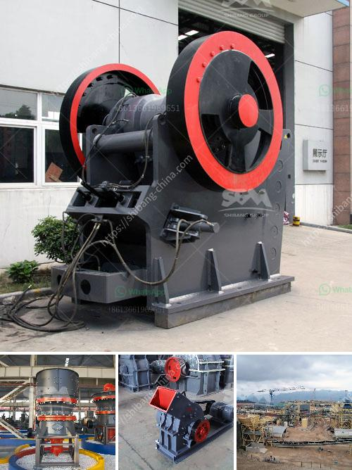

<h3>price of grinder machine</h3>
Grinder machines have become an essential tool for various industries, including construction, manufacturing, and food processing. These machines serve the purpose of grinding, polishing, and cutting materials, making them indispensable in today's fast-paced world. However, defining the price of a grinder machine can be a challenging task due to several factors influencing their cost. In this article, we will explore the price range of grinder machines, consider the contributing factors, and discuss their significance in different industries.

Before diving into the specifics, it is crucial to understand that grinder machines vary significantly in terms of their functionality, performance, size, and power consumption. Therefore, the price range of these machines can be vast, starting from as low as $50 to as high as $10,000 or more.

One of the most crucial factors that determine the cost of a grinder machine is its purpose and functionality. For instance, small, handheld grinders used for simple tasks like sharpening blades or polishing surfaces tend to be more affordable, typically ranging from $50 to $200. However, if you require a grinder machine to perform heavy-duty tasks such as grinding large metal surfaces or cutting through hard materials, you can expect to pay a significantly higher price, generally falling within the range of $500 to $2,000.

Another crucial factor influencing the price of grinder machines is their power and performance. Generally, higher-powered machines with advanced features and capabilities come with a higher price tag. These machines are designed to handle demanding tasks efficiently and effectively. For example, industrial-grade bench grinders with robust motors and adjustable speed settings usually cost between $500 and $5,000, depending on their size and power.

Size and capacity also contribute to the cost of grinder machines. Larger machines with greater grinding capacities are generally more expensive due to the increased materials and components required. For instance, a small tabletop grinder machine suitable for household use can cost around $100, whereas a large industrial grinder with a massive grinding capacity can range from $2,000 to $10,000.

The quality and durability of the grinder machine's components also play a significant role in determining its price. Machines made from high-quality materials like stainless steel or cast iron tend to cost more due to their long-lasting nature. Furthermore, grinder machines from reputable brands, known for their reliability and excellent customer support, can be priced higher than lesser-known brands due to their reputation and trustworthiness.

Furthermore, the geographical location and market demand also affect the price of grinder machines. In regions where there is high demand and limited supply, the prices tend to be higher compared to areas with abundant availability.

In conclusion, the price of a grinder machine can vary considerably due to multiple factors. Functionality, power, size, capacity, quality, and market demand are key considerations when determining the cost. It is essential to thoroughly analyze your requirements before investing in a grinder machine to ensure you select the one that meets your needs without overspending. By understanding the price range and factors influencing it, you can make an informed decision and acquire a grinder machine that is not only efficient but also offers excellent value for your investment.
<h3>Contact us</h3><ul><li><strong>Whatsapp:&nbsp;<a href="https://wa.me/8613661969651">+8613661969651</a></strong></li><li><a href="https://swt.shibang-china.com/?git&amp;zhl&amp;price of grinder machine"><strong>Online Service(chat now)</strong></a></li></ul><h3>Related</h3><ul><li><a href='crushing roller mill japan.md'>crushing roller mill japan</a></li><li><a href='jaw crusher 200 tonnes per hour.md'>jaw crusher 200 tonnes per hour</a></li><li><a href='jaw crusher for hire south africa for limestone.md'>jaw crusher for hire south africa for limestone</a></li><li><a href='jaw crusher moby 600.md'>jaw crusher moby 600</a></li><li><a href='machine for crushing rock.md'>machine for crushing rock</a></li></ul>