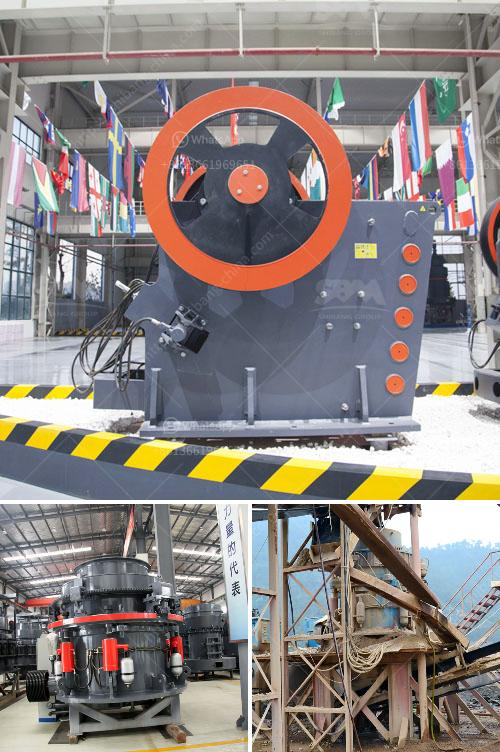

<h3>price of grinding mills in kenya</h3>
Grinding mills are commonly used in the mining industry to crush and grind ore into finer particles for further processing. But how much do these cost in Kenya? Well, this article will provide you with an overview of the prices of grinding mills in Kenya.

The price of a grinding mill in Kenya is influenced by various factors, such as the type, size, and capacity of the mill. For instance, a small size grinding mill may cost between Kshs 70,000 to Kshs 150,000 while a large size grinding mill may range from Kshs 160,000 to Kshs 450,000.

The cost of purchasing a grinding mill in Kenya depends on the materials used to manufacture it, the location of the manufacturer, and the shipping and transportation costs. These factors can significantly affect the final price of the grinding mill.

In addition to the basic cost of the grinding mill, there may be additional costs associated with its installation and maintenance. It is important to consider all these factors before making a purchasing decision.

Furthermore, it is worth noting that there are various types of grinding mills available in the Kenyan market, each with different features and capabilities. Some common types include ball mills, hammer mills, and vertical mills. The specific type of mill suitable for your needs will also impact the price.

When it comes to purchasing a grinding mill in Kenya, it is advisable to shop around and compare prices from different suppliers. This will give you a better understanding of the market and help you make an informed decision.

To conclude, the price of grinding mills in Kenya varies depending on factors such as type, size, capacity, materials used, and additional costs. It is essential to consider all these factors before making a purchase. By doing thorough research and comparing prices, you can find a grinding mill that suits your needs and budget.
<h3>Contact us</h3><ul><li><strong>Whatsapp:&nbsp;<a href="https://wa.me/8613661969651">+8613661969651</a></strong></li><li><a href="https://swt.shibang-china.com/?git&amp;zhl&amp;price of grinding mills in kenya"><strong>Online Service(chat now)</strong></a></li></ul><h3>Related</h3><ul><li><a href='sand crusher machine price at india.md'>sand crusher machine price at india</a></li><li><a href='list of gold mining company in zimbabwe.md'>list of gold mining company in zimbabwe</a></li><li><a href='raymond mill in kenya.md'>raymond mill in kenya</a></li><li><a href='jaw crusher 200 tonnes per hour.md'>jaw crusher 200 tonnes per hour</a></li><li><a href='mobile crusher capacity 200 ton per hour.md'>mobile crusher capacity 200 ton per hour</a></li></ul>