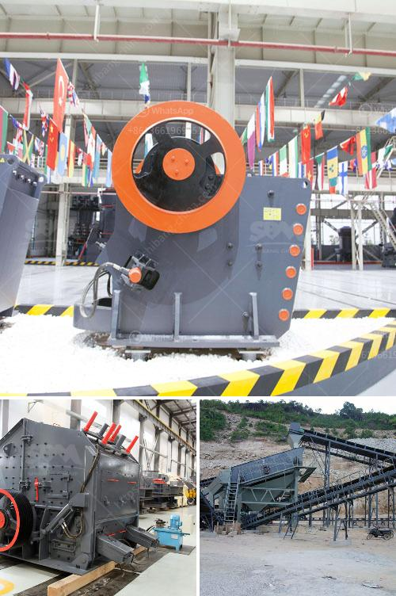

<h3>price of grinding mills in uganda</h3>
The cost of grinding mills in Uganda is usually determined by the sellers and the buyers. The factors that affect the grinding mill price include, but are not limited to, the following:

1. The quality of the grinding mill: The mill with the best quality and performance will naturally have a higher price. It is essential to invest in a durable grinding mill that will serve you for an extended period.

2. Size and capacity: The size of the grinding mill and its motor's capacity will affect the price. Larger mills with higher capacities will generally cost more than smaller ones. Buyers should consider their needs and intended use to select the appropriate size and capacity.

3. Brand and reputation: Well-established brands often charge a premium for their products due to their reputation for quality and reliability. While these mills may be more expensive, they are often worth the extra cost as they are proven to be efficient and long-lasting.

4. Source of power: The type of power used by the grinding mill affects its price as well. Mills that require electricity typically cost less than diesel-powered mills because electricity is more accessible and affordable in most urban areas.

5. Availability and location: The availability of grinding mills and their proximity to the buyer can influence the price. If there is high demand for mills in a particular area, the price may be higher due to limited supply or transportation costs.

It is recommended that buyers compare prices and specifications from different sellers before making a purchase decision. Consulting with experts or researching online can help buyers find the best deals and avoid paying exorbitant prices. Additionally, it is crucial to consider the long-term costs of maintenance and spare parts when evaluating the overall affordability of a grinding mill.

In conclusion, the cost of grinding mills in Uganda can vary depending on several factors such as quality, size, brand, power source, and availability. Buyers should carefully consider these factors to make an informed purchasing decision and ensure that they are getting the best value for their money.
<h3>Contact us</h3><ul><li><strong>Whatsapp:&nbsp;<a href="https://wa.me/8613661969651">+8613661969651</a></strong></li><li><a href="https://swt.shibang-china.com/?git&amp;zhl&amp;price of grinding mills in uganda"><strong>Online Service(chat now)</strong></a></li></ul><h3>Related</h3><ul><li><a href='ball mills for cement grinding.md'>ball mills for cement grinding</a></li><li><a href='stone crusher plant project report.md'>stone crusher plant project report</a></li><li><a href='price of grinding mills in uganda.md'>price of grinding mills in uganda</a></li><li><a href='gypsum powder making machine pdf.md'>gypsum powder making machine pdf</a></li><li><a href='rock crusher machine agent in malaysia.md'>rock crusher machine agent in malaysia</a></li></ul>