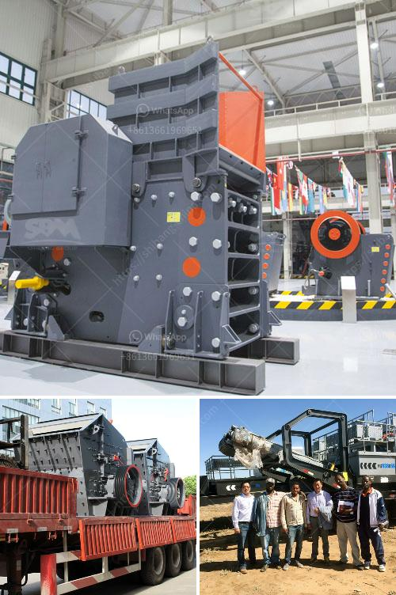

<h3>price of mini cement plant india</h3>
The cement industry in India is booming, with the country being the second-largest producer in the world. With the increasing demand for cement, more and more entrepreneurs are looking to set up mini cement plants in India, particularly in rural areas. These mini cement plants are an ideal solution for small-scale cement production, ensuring supply meets local demand.

When considering the price of a mini cement plant in India, several factors need to be taken into account. The cost of land, construction materials, machinery, and labor are primary components that determine the overall cost. Additionally, government regulations, taxes, and licensing fees vary from state to state and should be included in the calculation.

On average, the price of a mini cement plant in India can range from INR 25 to 100 crores (approximately $3.4 to 13.7 million USD), depending on the capacity and size of the plant. Mini cement plants with a capacity between 50 and 100 tons per day typically cost around INR 50 to 90 crores (approximately $6.9 to 12.4 million USD). Larger plants with a capacity between 100 and 200 tons per day can cost between INR 80 to 120 crores (approximately $11 to 16.5 million USD).

It is important to note that these cost estimates are approximate and can vary significantly based on various factors, including project location, infrastructure requirements, and cost fluctuations in raw materials and equipment.

Setting up a mini cement plant in India has its advantages. As mentioned earlier, it helps meet local demand, ensuring a continuous supply of cement. Additionally, it provides employment opportunities in rural areas, contributing to the economic development of the region. Moreover, mini cement plants are more energy-efficient and eco-friendly compared to larger cement plants, minimizing the carbon footprint.

Entrepreneurs interested in establishing a mini cement plant in India should conduct thorough research, including a feasibility study and cost analysis. It is advisable to consult with industry professionals and seek expert guidance throughout the process. Additionally, understanding the local market dynamics, compliance requirements, and securing necessary approvals from concerned authorities are crucial steps for a successful cement plant venture.

In conclusion, the price of a mini cement plant in India varies depending on multiple factors. However, with the growing cement demand and benefits associated with mini cement plants, investing in this sector can offer promising returns.
<h3>Contact us</h3><ul><li><strong>Whatsapp:&nbsp;<a href="https://wa.me/8613661969651">+8613661969651</a></strong></li><li><a href="https://swt.shibang-china.com/?git&amp;zhl&amp;price of mini cement plant india"><strong>Online Service(chat now)</strong></a></li></ul><h3>Related</h3><ul><li><a href='limestone micronizer machine limestone micronizer mill.md'>limestone micronizer machine limestone micronizer mill</a></li><li><a href='andhra pradesh coal crusher equipment price.md'>andhra pradesh coal crusher equipment price</a></li><li><a href='2000 kilos hammer mill.md'>2000 kilos hammer mill</a></li><li><a href='sell crusher of jaw in peru.md'>sell crusher of jaw in peru</a></li><li><a href='small diesel engine jaw crusher.md'>small diesel engine jaw crusher</a></li></ul>