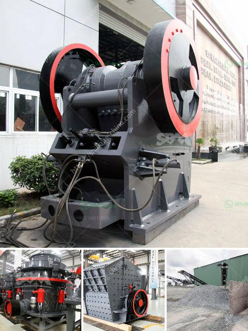

<h3>price of recycling equipment in italy</h3>
Recycling continues to play a pivotal role in Italy's commitment to environmental sustainability and resource management. As the nation strives to achieve its ambitious recycling targets, the demand for reliable and efficient recycling equipment has grown significantly. In this article, we will explore the price of recycling equipment in Italy, highlighting its value as a worthwhile investment towards building a more sustainable future.

Recycling equipment forms the backbone of any modern recycling facility. These machines are designed to process, sort, and separate recyclable materials, streamlining the recycling process and maximizing resource recovery. With proper recycling equipment, various materials such as plastics, glass, metals, paper, and electronic waste can be efficiently recycled, diverting them from landfills.

The price of recycling equipment varies depending on several factors such as the type of equipment, its capacity, technology, and specifications. Additionally, the cost can be influenced by market demand, exchange rates, and supplier reputation. It is important to consider the specific requirements of each recycling facility, as selecting the appropriate machinery is crucial for optimizing recycling operations and achieving the desired results.

1. Shredders and Crushers: These machines are used to reduce the size of various materials such as plastics, paper, and scrap metal. Prices for shredders can range from €10,000 to €100,000, depending on their capacity, cutting technology, and power consumption.

2. Sorting Systems: Sorting equipment employs technologies such as optical sensors, magnets, and air classifiers to separate different types of recyclable materials. The cost of sorting systems can range from €50,000 to several million euros, contingent upon their sophistication, speed, and level of automation.

3. Balers and Compactors: These machines are used to compress recyclable materials into dense, manageable bales for easier transportation and storage. Balers and compactors typically cost between €10,000 and €150,000, depending on their size, pressing force, and features.

4. Plastic Extruders and Injection Molding Machines: These specialized units are necessary for processing plastic waste into new products. The price range for plastic extruders and injection molding machines varies greatly, starting from €5,000 for basic models but can exceed €500,000 for high-capacity, industrial-grade equipment.

5. Recycling Trucks and Collection Vehicles: Efficient waste collection and transport are crucial to the recycling process. Prices for recycling trucks and collection vehicles can start from approximately €50,000 for smaller models, while larger and more specialized options can exceed €100,000.

Investing in recycling equipment is essential for Italy to achieve its recycling goals and promote a circular economy. Although the initial costs can be significant, the long-term benefits are numerous and far-reaching, including reduced waste, increased resource recovery, and lower environmental impact. By embracing innovative recycling technologies and equipment, Italy can set a positive example for other countries, promoting sustainable development and protecting our precious resources for future generations.
<h3>Contact us</h3><ul><li><strong>Whatsapp:&nbsp;<a href="https://wa.me/8613661969651">+8613661969651</a></strong></li><li><a href="https://swt.shibang-china.com/?git&amp;zhl&amp;price of recycling equipment in italy"><strong>Online Service(chat now)</strong></a></li></ul><h3>Related</h3><ul><li><a href='gypsum factory machines in india.md'>gypsum factory machines in india</a></li><li><a href='crushers for granite aggregate.md'>crushers for granite aggregate</a></li><li><a href='big crushing machine.md'>big crushing machine</a></li><li><a href='stone crushing machine manufacturer.md'>stone crushing machine manufacturer</a></li><li><a href='graphite mining india.md'>graphite mining india</a></li></ul>