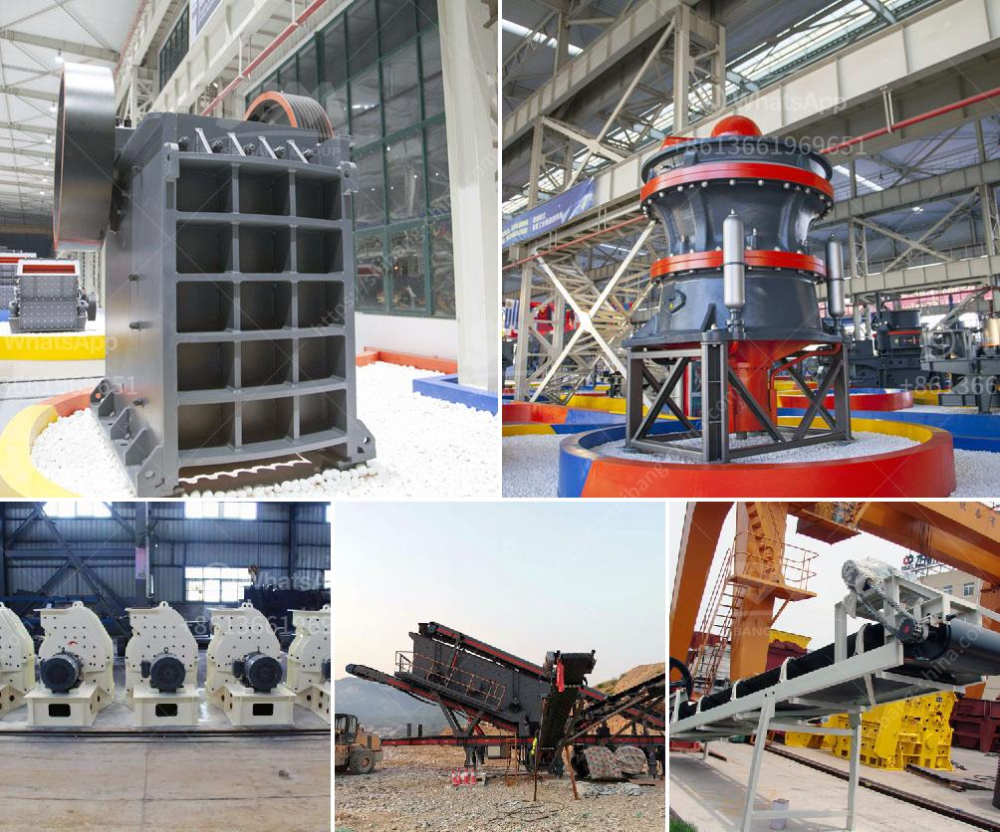

<h3>price of tph stone crusher</h3>
The price of tph stone crusher is influenced by many factors, such as quarrying process, market demand, infrastructure development and key suppliers, and manufacturers' production technology. Therefore, customers should take many factors into account when selecting the appropriate equipment to maximize their benefits.

The first factor, quarrying process, refers to the different quarrying operations involved in the production of crushed stone. In general, quarries may be categorized into two types – hard rock quarries and sand and gravel quarries. Hard rock quarries usually produce a more uniform product compared to sand and gravel quarries, which often produce varying sizes of stone.

Next, market demand plays a crucial role in determining the price of tph stone crusher. High market demand leads to increased competition among manufacturers, resulting in higher prices. On the other hand, a lower market demand may drive down the price due to decreased competition. It is important for buyers to understand the market conditions and adjust their expectations accordingly.

Infrastructure development is another significant factor that affects the price of tph stone crusher. Developing countries, especially those with rapid economic growth, often require massive amounts of construction materials, including crushed stone. This increased demand can drive up prices as manufacturers strive to meet the rising market demand.

Moreover, the cost and availability of key components and equipment suppliers also impact the final price. Some manufacturers may have exclusive rights to certain components, which can drive up the overall price. Additionally, the production technology employed by manufacturers can also influence the price. Advanced technology often increases production efficiency, resulting in lower production costs and potentially lower prices for customers.

When considering the price of tph stone crusher, it is essential to engage in a comprehensive market analysis and research to find the best equipment at the most reasonable price. Buyers should compare prices, evaluate the quality of equipment, and assess the after-sales service offered by manufacturers. It is also recommended to consult industry experts or seek advice from experienced individuals who can provide valuable insights and guidance.

To conclude, the price of tph stone crusher is determined by various factors, including quarrying process, market demand, infrastructure development, and key suppliers. Buyers should thoroughly assess these factors and analyze the market to select a cost-effective equipment that meets their specific requirements. By doing so, customers can ensure that they make an informed decision and obtain the best value for their investment.
<h3>Contact us</h3><ul><li><strong>Whatsapp:&nbsp;<a href="https://wa.me/8613661969651">+8613661969651</a></strong></li><li><a href="https://swt.shibang-china.com/?git&amp;zhl&amp;price of tph stone crusher"><strong>Online Service(chat now)</strong></a></li></ul><h3>Related</h3><ul><li><a href='cone crusher for sale in uae.md'>cone crusher for sale in uae</a></li><li><a href='price for sand machine.md'>price for sand machine</a></li><li><a href='stone crushing machine manufacturer.md'>stone crushing machine manufacturer</a></li><li><a href='technical specification belt conveyors.md'>technical specification belt conveyors</a></li><li><a href='ballast quarry crusher machines.md'>ballast quarry crusher machines</a></li></ul>