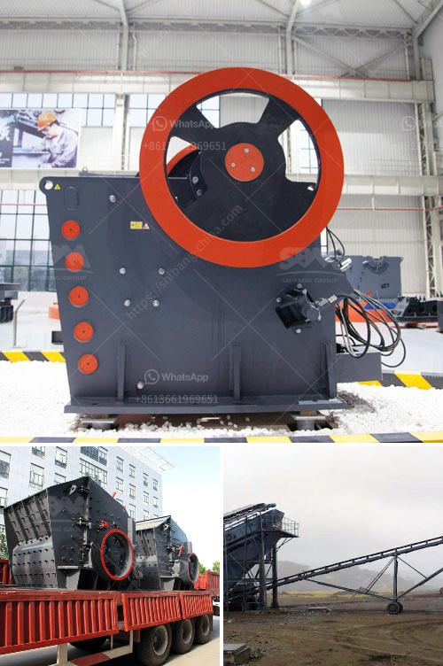

<h3>price stone crusher</h3>
Price of the stone crusher depends on several factors such as the measurements of the crusher, the quality of equipment, the price of labor and the transportation cost. The cost of the stone crusher machine is very competitive, and it has been favorably received by customers in various countries and regions.

The price of a stone crusher machine in North America is often considered as the primary factor affecting its production capacity and economic benefits. Stone crusher machines are very popular in North America because of the large-scale mining and construction industry. In recent years, with the development of the local economy, construction projects in North America have been increasing, which leads to a high demand for stone crushers.

One of the factors that affect the price of the stone crusher machine is the type of the crusher. Different types of stone crushers have different prices. For example, the jaw crusher is suitable for primary and secondary crushing of materials, with a compressive strength of less than 320MPa. The cone crusher is widely used for secondary and fine crushing in the fields of mining, chemical industry, building materials, metallurgy and so on. It is suitable for crushing various ores and rocks with medium and high hardness. Therefore, the price of the stone crusher with different types is also different.

Another factor affecting the price of the stone crusher machine is the quality of the equipment. Different stone crusher machines have different quality. For example, the jaw crusher and impact crusher have complete specifications and the feeding size ranges from 125mm to 750mm, which makes them have competitive price and suitable for medium and large-sized production scale. The cone crusher is suitable for fine crushing, while the vertical impact crusher is suitable for ultra-fine crushing.

Labor cost also affects the price of the stone crusher machine. If the manufacturer uses more advanced equipment and better materials, the labor cost is higher. If the manufacturer uses lower-quality materials and less advanced technology, the labor cost is lower. Therefore, the price of a stone crusher with high labor cost is relatively high.

Transportation cost also affects the price of the stone crusher machine. If the distance between the stone crusher and the construction site is long, the transportation cost is high. If there are nearby stone crushers, the transportation cost is relatively low. Therefore, the price of a stone crusher machine with high transportation cost is higher.

In conclusion, the price of a stone crusher machine depends on many factors. The type of the crusher, the quality of the equipment, the labor cost, the transportation cost, the measurement of the crusher, etc. all affect the price of the stone crusher. There are some stone crushers for your choice, such as jaw crusher, impact crusher, cone crusher, and vertical shaft impact crusher, etc. You can choose the appropriate machine according to your own needs and budget.
<h3>Contact us</h3><ul><li><strong>Whatsapp:&nbsp;<a href="https://wa.me/8613661969651">+8613661969651</a></strong></li><li><a href="https://swt.shibang-china.com/?git&amp;zhl&amp;price stone crusher"><strong>Online Service(chat now)</strong></a></li></ul><h3>Related</h3><ul><li><a href='cement plant in riyadh.md'>cement plant in riyadh</a></li><li><a href='aggregate processing equipment.md'>aggregate processing equipment</a></li><li><a href='hammer mill suppliers in kenya.md'>hammer mill suppliers in kenya</a></li><li><a href='crusher information cone crusher mine.md'>crusher information cone crusher mine</a></li><li><a href='limestone screen high frequency used.md'>limestone screen high frequency used</a></li></ul>