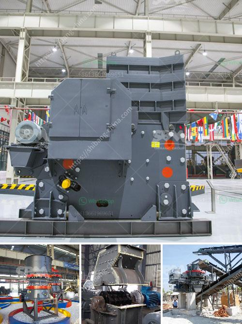

<h3>prices for stone gold mills in south africa</h3>
Stone mills are essential tools in the gold mining industry, used to grind down large pieces of ore into smaller, more manageable particles. These mills play a crucial role in extracting gold from the mined materials, as they help in crushing and milling the ore to release the precious metal.

In South Africa, where gold mining has been a dominant industry for decades, stone gold mills are in high demand. These mills come in various sizes and capacities, catering to the needs of both small-scale mines and large-scale mining operations.

The price range for stone gold mills in South Africa varies depending on the model, capacity, and features. For smaller operations and artisanal miners, entry-level stone mills can be found at prices starting from around $500. These mills typically have lower capacities, ranging from 1 to 5 tons per hour, but still offer sufficient grinding power for smaller production requirements.

For medium to large-scale mining operations, stone gold mills with higher capacities are available, with prices starting from approximately $5,000. These mills can handle larger quantities of ore and offer increased productivity, making them suitable for more intensive mining operations.

It is important to note that the prices mentioned here are only a rough estimate and can vary depending on the market, supplier, and other factors. Additionally, buyers should factor in ongoing maintenance costs and replacement parts, as these may add to the overall expenses.

When purchasing stone gold mills in South Africa, it is crucial to choose reputable suppliers who offer reliable equipment and excellent after-sales support. The mining industry is highly competitive, and investing in quality machinery ensures durability and long-term productivity.

In conclusion, stone gold mills are vital tools in the gold mining industry in South Africa. The prices for these mills range from around $500 for smaller mills to over $5,000 for larger, high-capacity mills. Buyers should carefully consider their production requirements and choose reputable suppliers to ensure the best value for their investment.
<h3>Contact us</h3><ul><li><strong>Whatsapp:&nbsp;<a href="https://wa.me/8613661969651">+8613661969651</a></strong></li><li><a href="https://swt.shibang-china.com/?git&amp;zhl&amp;prices for stone gold mills in south africa"><strong>Online Service(chat now)</strong></a></li></ul><h3>Related</h3><ul><li><a href='mining hammer mill suppliers.md'>mining hammer mill suppliers</a></li><li><a href='used limestone milling machine.md'>used limestone milling machine</a></li><li><a href='cement mill manufacturers in italy.md'>cement mill manufacturers in italy</a></li><li><a href='gypsum crusher for sale india.md'>gypsum crusher for sale india</a></li><li><a href='micro grinding mill.md'>micro grinding mill</a></li></ul>