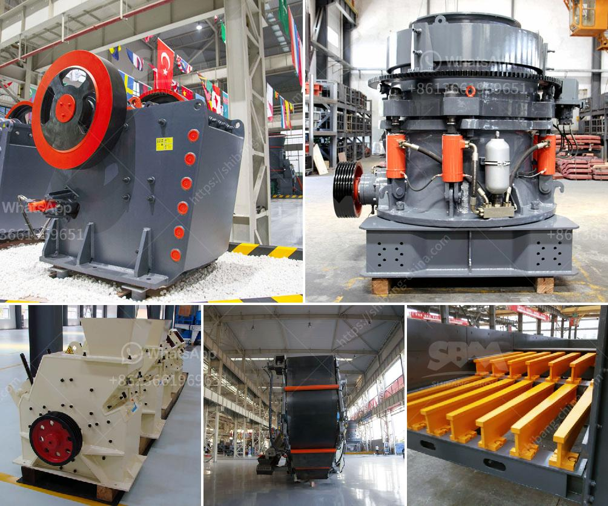

<h3>primary crusher used in south africa</h3>
The primary crusher plays a crucial role in the size reduction process in South Africa's mining industry. It is used to break down large chunks of rock into smaller pieces, making them easier to transport and process. Its main purpose is to reduce the size of the material to a size that can be handled by the downstream machinery. This article will explore the primary crusher used in South Africa, its types, and key factors to consider when purchasing one.

In the mining industry, South Africa is one of the leading producers of minerals such as gold, diamonds, and platinum. The country also has a thriving iron ore industry, which relies heavily on the primary crushers to break down the extracted ore into more manageable sizes.

There are several types of primary crushers used in South Africa. These include jaw crushers, gyratory crushers, and impact crushers. Jaw crushers are very popular in the mining industry due to their ability to crush materials of any hardness, making them highly versatile. Gyratory crushers are generally used for primary crushing purposes in underground mines and are well-suited for extremely high-capacity operations. Impact crushers, on the other hand, are used for less abrasive materials and are often used in the recycling industry.

When choosing a primary crusher in South Africa, there are several factors that need to be considered to ensure it meets the specific requirements of the mine. The first factor is the maximum feed size of the material. This determines the crusher's capacity and influences the output size produced. It is essential to select a primary crusher that can handle the maximum feed size expected in the mining operation.

Another important factor to consider is the throughput rate. This refers to the amount of material the crusher can process in a specified amount of time. The throughput rate will depend on the crusher's size, power, and operating conditions. It is crucial to select a primary crusher with a high throughput rate to ensure efficient and continuous operations.

The type of material being processed is also critical. Different materials have varying abrasiveness, hardness, and compressive strengths. It is essential to choose a primary crusher that can handle the specific material properties to avoid premature wear and tear.

Furthermore, the operating costs and maintenance requirements of the primary crusher should be considered. It is crucial to select a crusher that offers low operating costs and requires minimal maintenance. Regular maintenance can help extend the lifespan of the crusher and ensure optimal performance.

In conclusion, the primary crusher is a crucial piece of equipment in South Africa's mining industry. It is responsible for breaking down large rocks into smaller pieces, making them easier to transport and process. When purchasing a primary crusher, factors such as maximum feed size, throughput rate, material properties, operating costs, and maintenance requirements should be considered. By doing so, mining operators can select a crusher that meets their specific needs and ensures efficient and continuous operations.
<h3>Contact us</h3><ul><li><strong>Whatsapp:&nbsp;<a href="https://wa.me/8613661969651">+8613661969651</a></strong></li><li><a href="https://swt.shibang-china.com/?git&amp;zhl&amp;primary crusher used in south africa"><strong>Online Service(chat now)</strong></a></li></ul><h3>Related</h3><ul><li><a href='hydraulic jaw crusher.md'>hydraulic jaw crusher</a></li><li><a href='crusher corpses crusher company.md'>crusher corpses crusher company</a></li><li><a href='rental companies of mobile crusher.md'>rental companies of mobile crusher</a></li><li><a href='gold processing company china.md'>gold processing company china</a></li><li><a href='mobile dimension stone processing.md'>mobile dimension stone processing</a></li></ul>