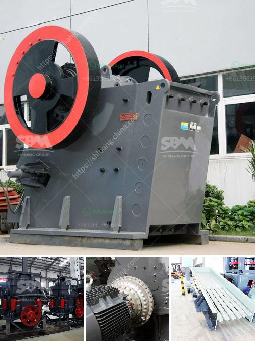

<h3>principle of impact crusher</h3>
The principle of impact crusher is simple. It uses striking energy to break material. When the material enters the plate hammer action zone, it is impacted by high-speed impact. Because of the strong impact energy, the material is crushed. Its striking energy is transferred to the rock material, causing it to be broken. The material is thrown at high speeds and collides with the materials in the crushing chamber. In this process, the initial impact is directly responsible for producing the primary fragmentation. This primary impact also generates a flywheel effect, leading to secondary collisions and further fragmentation.

The impact crusher consists of a rotor and an impact plate. The rotor is rigidly connected to the main shaft and is driven by a motor through a belt drive. The materials dropped into the feed hopper enter the crushing chamber and are pushed by the rotor's rotating hammer into the impact plate. On the impact plate, the material is crushed by the impact of the hammer, and then it is thrown back onto the crushing zone, colliding with the hammer again. This process is repeated until the material is discharged from the bottom of the machine.

The principle of impact crusher relies on the energy of high-speed operation. In the process of operation, the rotor rotates at a high speed driven by the motor. When the material enters the crushing chamber, it collides with the hammer on the rotor and is thrown against the impact plate. The high-speed impact energy generated by the material leads to the fragmentation of the material. This principle ensures the efficient operation and high crushing capacity of the impact crusher.

In conclusion, the principle of impact crusher involves a simple yet effective mechanism for crushing rocks and other materials. The high-speed operation and impact energy generated by the rotor and hammer play a crucial role in the breaking down of the material. This makes the impact crusher suitable for crushing various types of materials, such as limestone, granite, and concrete. Additionally, the adjustable impact plate allows for controlling the final product size. Overall, the principle behind the impact crusher ensures its effectiveness as a powerful crushing machine.
<h3>Contact us</h3><ul><li><strong>Whatsapp:&nbsp;<a href="https://wa.me/8613661969651">+8613661969651</a></strong></li><li><a href="https://swt.shibang-china.com/?git&amp;zhl&amp;principle of impact crusher"><strong>Online Service(chat now)</strong></a></li></ul><h3>Related</h3><ul><li><a href='used mobile crushers for sale south africa.md'>used mobile crushers for sale south africa</a></li><li><a href='vertical vertical roller mill drives.md'>vertical vertical roller mill drives</a></li><li><a href='ball mills for cement grinding.md'>ball mills for cement grinding</a></li><li><a href='100tph used crusher plant for sale.md'>100tph used crusher plant for sale</a></li><li><a href='70 tph limestone crusher weight.md'>70 tph limestone crusher weight</a></li></ul>