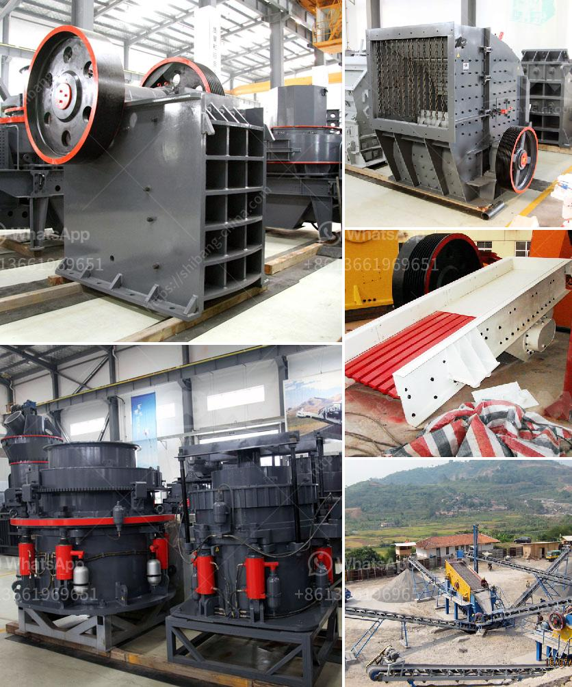

<h3>principle of operation of stone crusher</h3>
The principle of operation of a stone crusher is like that of a crushing appliance such as a jaw crusher or a cone crusher, which includes a finely crushed stone to be obtained from a stone quarry. It is delivered in a rough state to the primary crusher, which possesses the characteristics of the jaw crusher and the cone crusher, and operates according to the "squeeze" material principle. The properties of the material are changed using the application of pressure and temperature during the extraction and refining processes.

The stone crusher first breaks the stone ore into smaller particles, which are then broken by the secondary crusher. It contains metal cutting knives, which can neatly cut the stone into small particles. The stone is then crushed into different sizes by the vibrating screen for grading, and the large-sized ore material is further broken by the hammer crusher. Finally, it is evenly sent to the sand making machine with a certain running speed to produce various specifications of sand and stone.

The stone crusher is also equipped with a feeding bin and a fuel injection system, which is used to continuously and evenly feed materials to the crusher. The stone material enters the crusher through the feeding bin, and is divided into two parts by a plate feeder, wherein one part is fed into the middle of the high-speed rotating impeller in the stone crusher through the separator, and is rapidly accelerated in the impeller. During its acceleration, it collides with another part of the material that has fallen from the periphery of the disc. In this process, both the stone material between the impellers and the stone material between the periphery and the impellers will also collide and rub against each other, resulting in the formation of a vortex motion in the crushed cavity. The stone material is subjected to the multiple effects of crushing, impact, and grinding in the vortex motion, and is finally crushed into the desired particle size and discharged through the discharge port.

In addition, the stone crusher is equipped with a dust-proof device to prevent dust from being squeezed into the bearing. At the same time, the stone crusher is equipped with a fuel injection system, which can add grease to the bearing to prevent bearing wear and extend the service life of the equipment.

In summary, the principle of operation of a stone crusher is to crush and grind a hard stone into small particle sizes due to the application of pressure and temperature during the extraction and refining processes. The stone crusher utilizes multiple effects of crushing, impact, and grinding to achieve the desired particle size. It is equipped with various systems, such as feeding, discharging, dust-proof, and fuel injection, to ensure efficient and safe operation.
<h3>Contact us</h3><ul><li><strong>Whatsapp:&nbsp;<a href="https://wa.me/8613661969651">+8613661969651</a></strong></li><li><a href="https://swt.shibang-china.com/?git&amp;zhl&amp;principle of operation of stone crusher"><strong>Online Service(chat now)</strong></a></li></ul><h3>Related</h3><ul><li><a href='plant crushing materials in antioquia.md'>plant crushing materials in antioquia</a></li><li><a href='quarry plant making machine for sale in zimbabwe.md'>quarry plant making machine for sale in zimbabwe</a></li><li><a href='iron ore crushing equipment.md'>iron ore crushing equipment</a></li><li><a href='ultrafine grinding mill.md'>ultrafine grinding mill</a></li><li><a href='clay brick crusher manufacturers in pakistan.md'>clay brick crusher manufacturers in pakistan</a></li></ul>