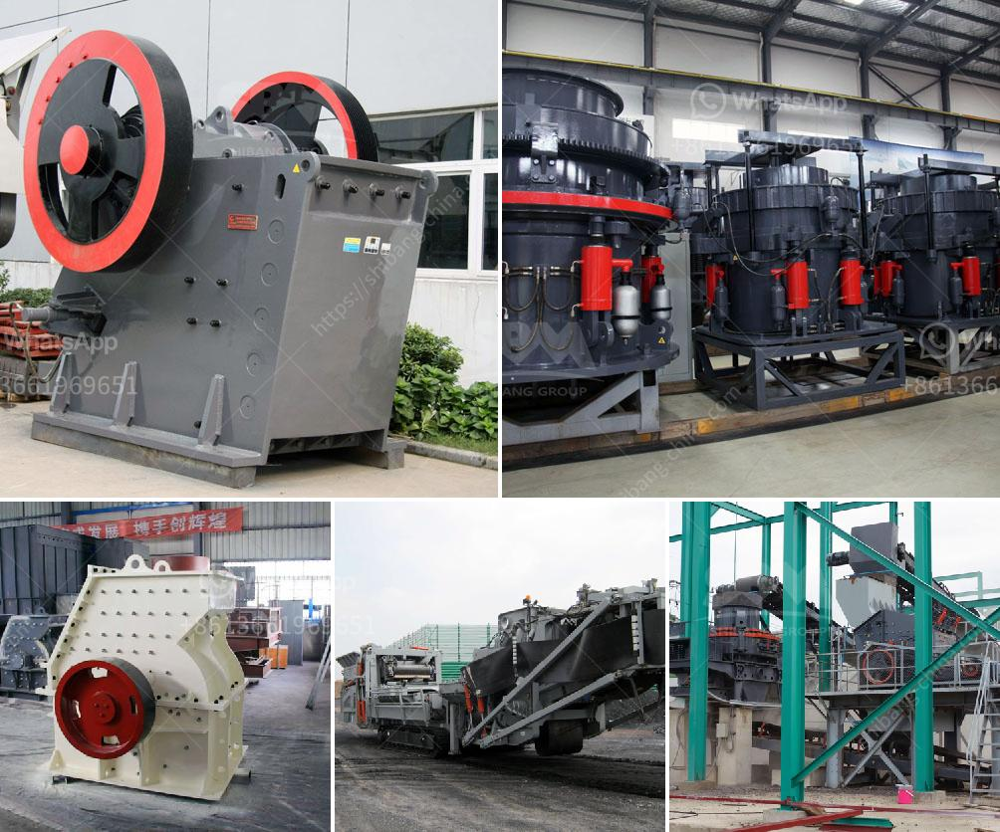

<h3>process flow gold copper mining</h3>
Mining operations are a crucial part of the supply chain for many industries. Gold, copper, and other precious metals and minerals are extracted from the earth through a multi-stage process involving crushing, grinding, flotation, and smelting. This article will discuss the processes involved in mining gold and copper ores with a particular focus on the process flow.

The mining process begins with the excavation of ore from open-pit or underground mines. The ore is then crushed, ground, and sieved to a suitable size for further processing. Large rocks and debris are usually removed before the primary crushing stage to ensure a consistent feed to the subsequent stages.

Once the ore is crushed, it is then ground into fine particles using various grinding techniques. This grinding process is crucial as it increases the surface area of the ore, allowing for better extraction of valuable metals. The ground ore is then mixed with water and chemicals in a flotation cell. The chemicals, known as frothers and collectors, selectively attach to and float the valuable minerals, while the waste material sinks to the bottom.

After the flotation process, the valuable minerals, including gold and copper, are concentrated and separated from the waste material, known as tailings. The concentrate is then dried and transported to a smelter for further processing. Smelting involves heating the concentrate to very high temperatures in a furnace, which melts the metals, allowing them to be separated from impurities.

In the case of gold, the smelting process further purifies the metal, separating it from any remaining impurities. The purified gold is then cast into bars or other desired shapes for use in various industries, such as jewelry, electronics, and dentistry.

For copper, the smelting process involves the addition of fluxes, which react with impurities, forming a slag that can be easily separated from the molten metal. The resulting molten copper is then cast into billets or ingots, which can be further processed into various forms, such as wire, tubing, or sheets.

It is important to note that the process flow for gold and copper mining can vary depending on the type of ore being mined and the desired end product. Some mining operations may employ additional processes, such as leaching or electro-winning, to extract and refine metals from ore that is not suitable for traditional flotation and smelting methods.

In conclusion, the process flow for gold and copper mining involves a series of stages, including excavation, crushing, grinding, flotation, and smelting. These stages are necessary to extract and refine valuable metals from the ore, enabling their use in various industries. As mining operations continue to evolve, new technologies and techniques may be employed to improve efficiency and minimize environmental impact.
<h3>Contact us</h3><ul><li><strong>Whatsapp:&nbsp;<a href="https://wa.me/8613661969651">+8613661969651</a></strong></li><li><a href="https://swt.shibang-china.com/?git&amp;zhl&amp;process flow gold copper mining"><strong>Online Service(chat now)</strong></a></li></ul><h3>Related</h3><ul><li><a href='pebbel stone crusher.md'>pebbel stone crusher</a></li><li><a href='grinding mill manufacturers.md'>grinding mill manufacturers</a></li><li><a href='process flow gold copper mining.md'>process flow gold copper mining</a></li><li><a href='crusher machine manufacturers.md'>crusher machine manufacturers</a></li><li><a href='quarry equipment manufacturer.md'>quarry equipment manufacturer</a></li></ul>