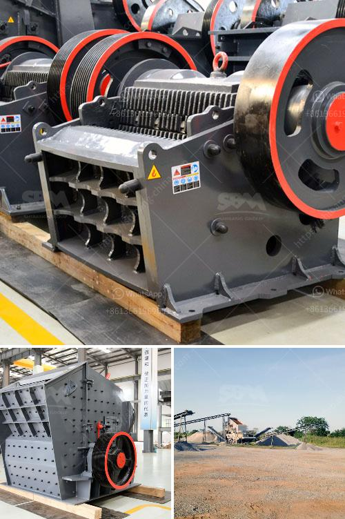

<h3>process for chromium separation from chromite ore</h3>
Chromite ore is a valuable mineral that is used in various industries for its multiple applications. One of the most important applications of chromite ore is the extraction of chromium metal. Chromium metal is predominantly used in the production of stainless steel, which is widely used in the manufacturing of kitchen utensils, appliances, and various other products due to its excellent resistance to corrosion.

The process of extracting chromium from chromite ore involves various steps. The first step in this process is crushing and grinding the chromite ore to prepare it for further separation. The finely ground chromite ore is then subjected to physical separation techniques such as gravity concentration or magnetic separation.

Gravity concentration is a widely used method for separating minerals based on their density differences. In this process, the crushed chromite ore is mixed with water and fed into a shaking table or jigging machine. The heavier chromite particles settle to the bottom, while the lighter gangue minerals are washed away. The concentrated chromite is then further processed to remove impurities.

Magnetic separation is another common method used for chromite ore separation. In this process, the crushed chromite ore is subjected to a magnetic field, which attracts the magnetic particles and separates them from the non-magnetic gangue minerals.

Once the chromite ore is separated from the impurities, the next step is to convert it into chromium metal. This is achieved through a process called smelting, where the chromite ore is mixed with a reducing agent such as coke and heated in a furnace. The heat and the reducing agent cause the reduction of chromium oxide (Cr2O3) present in the ore to metallic chromium (Cr).

The extracted chromium metal can then be further processed and alloyed with other elements to produce different grades of stainless steel or used in various other applications such as chrome plating.

In conclusion, the process of separating chromium from chromite ore involves several steps, including crushing, grinding, physical separation, and smelting. This process is crucial for obtaining high-quality chromium metal, which is widely used in various industries, particularly stainless steel production.
<h3>Contact us</h3><ul><li><strong>Whatsapp:&nbsp;<a href="https://wa.me/8613661969651">+8613661969651</a></strong></li><li><a href="https://swt.shibang-china.com/?git&amp;zhl&amp;process for chromium separation from chromite ore"><strong>Online Service(chat now)</strong></a></li></ul><h3>Related</h3><ul><li><a href='concrete crushers for rent.md'>concrete crushers for rent</a></li><li><a href='clinker grinding plant.md'>clinker grinding plant</a></li><li><a href='basalt crusher production.md'>basalt crusher production</a></li><li><a href='calcium carbonate mines in pakistan.md'>calcium carbonate mines in pakistan</a></li><li><a href='qurry crusher plant capacity.md'>qurry crusher plant capacity</a></li></ul>