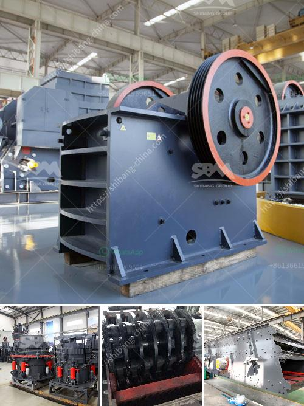

<h3>process of cement production</h3>
Cement is a versatile and crucial material used in construction and infrastructure projects worldwide. It is a blend of limestone, clay, and other materials that are heated to form a hard substance called clinker. This clinker is then ground into a fine powder, mixed with gypsum, and transformed into the final product: cement.

The process of cement production can be divided into three main stages: raw material preparation, clinker production, and cement grinding.

Firstly, a mixture of limestone and clay, or other materials, is crushed and grinded into a raw meal. This raw meal is then heated in a rotary kiln at a temperature of around 1,450 degrees Celsius to form clinker. The kiln is a large cylindrical structure that rotates, producing a gradual transition of the raw materials from one end to the other. During this process, chemical reactions occur, causing the raw meal to combine and form clinker.

Once the clinker is cooled, it is further ground into a fine powder along with gypsum, which acts as a setting regulator. This process, known as cement grinding, is conducted in a ball mill, which consists of a horizontal cylinder that is partially filled with grinding media and rotated on its axis. The ball mill grinds the clinker to a fine powder.

Finally, the cement is stored in silos before being shipped in bulk or in bags to its final destination. Cement can be used in various applications, such as the production of concrete, mortar, or even grout. Its versatility and durability make it an essential material in the construction industry.

The process of cement production requires a significant amount of energy and resources, resulting in carbon emissions and environmental impacts. However, advancements in technology and the use of alternative fuels, such as biomass or waste, are helping to reduce the industry's environmental footprint.

In conclusion, the process of cement production involves the extraction and grinding of raw materials, the formation of clinker, and the grinding of clinker into a fine powder. This versatile material is then stored and transported to be used in various construction applications. Efforts are being made to make cement production more sustainable and environmentally friendly.
<h3>Contact us</h3><ul><li><strong>Whatsapp:&nbsp;<a href="https://wa.me/8613661969651">+8613661969651</a></strong></li><li><a href="https://swt.shibang-china.com/?git&amp;zhl&amp;process of cement production"><strong>Online Service(chat now)</strong></a></li></ul><h3>Related</h3><ul><li><a href='part of ball mill.md'>part of ball mill</a></li><li><a href='grinding mill manufacturer in italy.md'>grinding mill manufacturer in italy</a></li><li><a href='raymond mill in kenya.md'>raymond mill in kenya</a></li><li><a href='cement formation process.md'>cement formation process</a></li><li><a href='enquiry crushing machine.md'>enquiry crushing machine</a></li></ul>