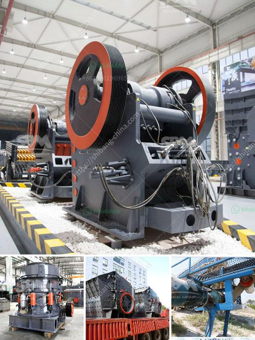

<h3>process of gravel quarrying crusher</h3>
The gravel quarrying process provides employment opportunities for local communities, stimulates economic growth, and contributes to sustainability and infrastructure development. This article aims to highlight the various stages involved in gravel quarrying and the crucial role of a crusher in the process.

Gravel quarrying refers to the extraction of gravel from a quarry, typically located near densely populated areas or construction sites. Gravel is a vital component used in the construction industry for roads, sidewalks, buildings, and landscaping. The process of quarrying gravel involves several stages that ensure the quality and usability of the final product.

Firstly, the identification of potential gravel deposits is a crucial step in the quarrying process. Geological surveys and assessments are conducted to discover areas with suitable gravel resources. Factors such as gravel quality, quantity, and accessibility to transportation infrastructure play a significant role in the decision-making process.

Once a suitable gravel deposit is identified, the extraction phase begins. Heavy machinery, such as excavators and bulldozers, is used to remove the topsoil and overburden, revealing the gravel deposits underneath. The extracted gravel is then transported to a processing plant for further treatment.

Processing the extracted gravel involves several steps to ensure its suitability for various construction purposes. The primary stage involves crushing the gravel into smaller sizes using a powerful machine called a crusher. A crusher is typically a machine composed of two metal plates, arranged to break larger rocks into smaller fragments. This fragmentation process facilitates easier handling, transportation, and further processing.

The crusher is an essential component in the gravel quarrying process, as it breaks down the larger rocks into smaller sizes that can be further processed for various construction purposes. Crushers can be stationary or mobile, depending on the scale of the quarry and the resources available. Mobile crushers offer flexibility in terms of location, allowing them to be easily transported to different sites, while stationary crushers are permanently installed at the quarry site.

After the initial crushing stage, the processed gravel is then screened to separate the different sizes required for specific construction applications. Screening involves passing the crushed gravel through a series of vibrating screens that filter out the desired sizes. The separated gravel is then stockpiled for further use or transported directly to construction sites.

In addition to crushing and screening, other processes may be required to enhance the quality of the gravel. These processes can include washing to remove impurities such as silt and clay, or the addition of additives to improve specific properties, such as durability or drainage capabilities.

Gravel quarrying, if managed sustainably, can provide numerous benefits to society and the environment. The process creates employment opportunities for local communities, stimulates economic growth through the supply of construction materials, and contributes to the development of infrastructure. Furthermore, gravel quarrying can be conducted with environmental considerations, such as land rehabilitation, dust control measures, and the implementation of sustainable extraction practices.

In conclusion, the process of gravel quarrying involves the identification of suitable deposits, extraction, processing, and the crucial stage of crushing using a crusher. This process ensures the production of high-quality gravel for various construction purposes. Gravel quarrying, if managed sustainably, contributes to economic growth, infrastructure development, and environmental sustainability.
<h3>Contact us</h3><ul><li><strong>Whatsapp:&nbsp;<a href="https://wa.me/8613661969651">+8613661969651</a></strong></li><li><a href="https://swt.shibang-china.com/?git&amp;zhl&amp;process of gravel quarrying crusher"><strong>Online Service(chat now)</strong></a></li></ul><h3>Related</h3><ul><li><a href='crusher price jaw crusher prices.md'>crusher price jaw crusher prices</a></li><li><a href='used stone crushers in south korea.md'>used stone crushers in south korea</a></li><li><a href='calcium calcium carbonate plants calcium.md'>calcium calcium carbonate plants calcium</a></li><li><a href='price crusher price bolivia.md'>price crusher price bolivia</a></li><li><a href='supplier stone crusher indonesia.md'>supplier stone crusher indonesia</a></li></ul>